# Diagrama de Actividad - Personalizar Café

## Contexto

Diagrama de actividad que muestra el flujo de la operación **"Personalizar Café"** desde la perspectiva de la interacción con el usuario. 

Este diagrama se centra en las **decisiones y acciones del usuario**, no en los procesos internos de la máquina.

---

## Diagrama de Actividad - Interacción con Usuario

```mermaid
flowchart TD
    Start([Usuario ha seleccionado<br/>tipo de bebida]) --> MostrarOpciones[Sistema muestra<br/>opciones de personalización]
    
    MostrarOpciones --> PreguntarIntensidad{Usuario desea cambiar<br/>intensidad del café?}
    
    PreguntarIntensidad -->|Sí| SolicitarIntensidad[Solicitar intensidad]
    PreguntarIntensidad -->|No| PreguntarLeche
    
    SolicitarIntensidad --> OpcionesIntensidad[Mostrar opciones:<br/>Suave / Medio / Fuerte]
    OpcionesIntensidad --> SeleccionarIntensidad[Usuario selecciona<br/>intensidad]
    SeleccionarIntensidad --> GuardarIntensidad[Guardar preferencia<br/>de intensidad]
    GuardarIntensidad --> PreguntarLeche
    
    PreguntarLeche{Usuario desea cambiar<br/>cantidad de leche?}
    
    PreguntarLeche -->|Sí| TipoBebida{La bebida<br/>incluye leche?}
    PreguntarLeche -->|No| PreguntarAzucar
    
    TipoBebida -->|No| MensajeNoLeche[Mostrar mensaje:<br/>Esta bebida no lleva leche]
    MensajeNoLeche --> PreguntarAzucar
    
    TipoBebida -->|Sí| SolicitarLeche[Solicitar cantidad<br/>de leche]
    SolicitarLeche --> OpcionesLeche[Mostrar opciones:<br/>Sin leche / Poca / Normal / Extra]
    OpcionesLeche --> SeleccionarLeche[Usuario selecciona<br/>cantidad]
    SeleccionarLeche --> GuardarLeche[Guardar preferencia<br/>de leche]
    GuardarLeche --> PreguntarAzucar
    
    PreguntarAzucar{Usuario desea cambiar<br/>cantidad de azúcar?}
    
    PreguntarAzucar -->|Sí| SolicitarAzucar[Solicitar cantidad<br/>de azúcar]
    PreguntarAzucar -->|No| PreguntarTamano
    
    SolicitarAzucar --> OpcionesAzucar[Mostrar opciones:<br/>Sin azúcar / 1 sobre / 2 sobres / 3 sobres]
    OpcionesAzucar --> SeleccionarAzucar[Usuario selecciona<br/>cantidad]
    SeleccionarAzucar --> GuardarAzucar[Guardar preferencia<br/>de azúcar]
    GuardarAzucar --> PreguntarTamano
    
    PreguntarTamano{Usuario desea cambiar<br/>tamaño?}
    
    PreguntarTamano -->|Sí| SolicitarTamano[Solicitar tamaño]
    PreguntarTamano -->|No| MostrarResumen
    
    SolicitarTamano --> OpcionesTamano[Mostrar opciones:<br/>Pequeño / Mediano / Grande]
    OpcionesTamano --> SeleccionarTamano[Usuario selecciona<br/>tamaño]
    SeleccionarTamano --> CalcularPrecio[Calcular ajuste<br/>de precio]
    CalcularPrecio --> GuardarTamano[Guardar preferencia<br/>de tamaño]
    GuardarTamano --> MostrarResumen
    
    MostrarResumen[Mostrar resumen:<br/>Bebida personalizada<br/>y precio total]
    
    MostrarResumen --> ConfirmarPersonalizacion{Usuario confirma<br/>personalización?}
    
    ConfirmarPersonalizacion -->|Sí| PreguntarGuardar{Usuario tiene<br/>cuenta registrada?}
    ConfirmarPersonalizacion -->|No| Volver{Usuario quiere<br/>modificar algo?}
    
    Volver -->|Sí, cambiar intensidad| SolicitarIntensidad
    Volver -->|Sí, cambiar leche| TipoBebida
    Volver -->|Sí, cambiar azúcar| SolicitarAzucar
    Volver -->|Sí, cambiar tamaño| SolicitarTamano
    Volver -->|No, cancelar| Cancelar[Restaurar valores<br/>por defecto]
    Cancelar --> Fin1([Personalización<br/>cancelada])
    
    PreguntarGuardar -->|Sí| OfrecerGuardar{Usuario desea guardar<br/>como favorito?}
    PreguntarGuardar -->|No| ProcederPago
    
    OfrecerGuardar -->|Sí| SolicitarNombre[Solicitar nombre<br/>para el favorito]
    OfrecerGuardar -->|No| ProcederPago
    
    SolicitarNombre --> UsuarioIngresaNombre[Usuario ingresa<br/>nombre]
    UsuarioIngresaNombre --> ValidarNombre{Nombre válido<br/>y único?}
    
    ValidarNombre -->|No| ErrorNombre[Mostrar error:<br/>Nombre ya existe o inválido]
    ErrorNombre --> SolicitarNombre
    
    ValidarNombre -->|Sí| GuardarFavorito[Guardar configuración<br/>como favorito]
    GuardarFavorito --> MensajeExito[Mostrar mensaje:<br/>Favorito guardado]
    MensajeExito --> ProcederPago
    
    ProcederPago[Proceder a<br/>pantalla de pago]
    ProcederPago --> Fin2([Personalización<br/>completada])
    
    style Start fill:#90EE90
    style Fin1 fill:#FFB6C1
    style Fin2 fill:#90EE90
    style PreguntarIntensidad fill:#FFE4B5
    style PreguntarLeche fill:#FFE4B5
    style PreguntarAzucar fill:#FFE4B5
    style PreguntarTamano fill:#FFE4B5
    style TipoBebida fill:#FFE4B5
    style ConfirmarPersonalizacion fill:#FFE4B5
    style PreguntarGuardar fill:#FFE4B5
    style OfrecerGuardar fill:#FFE4B5
    style ValidarNombre fill:#FFE4B5
    style Volver fill:#FFE4B5
```

---

## Descripción del Flujo

### Estado Inicial
El usuario ya ha seleccionado un tipo de bebida (ej: "Café con leche") y ahora puede personalizarla.

### Opciones de Personalización

El sistema presenta secuencialmente las siguientes opciones:

#### 1. **Intensidad del Café**
- **Opciones disponibles**: Suave / Medio / Fuerte
- **Por defecto**: Medio
- **Impacto**: Afecta la cantidad de café molido utilizado
- **Interacción**: Usuario puede cambiar o mantener el valor por defecto

#### 2. **Cantidad de Leche**
- **Opciones disponibles**: Sin leche / Poca / Normal / Extra
- **Por defecto**: Depende del tipo de bebida seleccionado
- **Validación**: Si la bebida no incluye leche (ej: Espresso), el sistema muestra un mensaje informativo
- **Interacción**: Solo disponible para bebidas que llevan leche

#### 3. **Cantidad de Azúcar**
- **Opciones disponibles**: Sin azúcar / 1 sobre / 2 sobres / 3 sobres
- **Por defecto**: Sin azúcar
- **Interacción**: Usuario puede añadir azúcar según preferencia

#### 4. **Tamaño de la Bebida**
- **Opciones disponibles**: Pequeño (150ml) / Mediano (250ml) / Grande (350ml)
- **Por defecto**: Mediano
- **Impacto en precio**: El tamaño grande puede tener un costo adicional
- **Interacción**: Sistema recalcula el precio si hay cambio de tamaño

### Flujo de Confirmación

Una vez configuradas todas las opciones:

1. **Sistema muestra resumen** con:
   - Tipo de bebida
   - Todas las personalizaciones aplicadas
   - Precio total (incluyendo ajustes por tamaño)

2. **Usuario confirma o modifica**:
   - Si confirma → continúa al guardado de favoritos (si aplica)
   - Si no confirma → puede volver a modificar cualquier opción específica
   - Puede cancelar completamente (restaura valores por defecto)

### Guardado de Favoritos (Opcional)

Si el usuario está registrado:

1. **Sistema ofrece guardar la configuración** como favorito
2. Si acepta:
   - Usuario ingresa un nombre descriptivo (ej: "Mi café mañanero")
   - Sistema valida que el nombre sea único
   - Configuración se guarda en el perfil del usuario
3. En futuras visitas, el usuario puede cargar este favorito directamente

### Finalización

- **Éxito**: Usuario procede a la pantalla de pago con su bebida personalizada
- **Cancelación**: Se restauran valores por defecto y se sale de personalización

---

## Puntos de Decisión del Usuario

El diagrama incluye las siguientes **decisiones que toma el usuario**:

| Decisión | Opciones | Impacto |
|----------|----------|---------|
| ¿Cambiar intensidad? | Sí / No | Afecta sabor del café |
| ¿Cambiar leche? | Sí / No | Solo si la bebida la incluye |
| ¿Cambiar azúcar? | Sí / No | Añade dulzor |
| ¿Cambiar tamaño? | Sí / No | Puede afectar precio |
| ¿Confirmar personalización? | Sí / No | Continuar o volver a modificar |
| ¿Modificar algo? | Específica qué / Cancelar | Vuelve a la opción elegida |
| ¿Guardar como favorito? | Sí / No | Solo para usuarios registrados |

---

## Diferencia: Diagrama de Actividad vs Diagrama de Secuencia

### Diagrama de Actividad (este documento)
- **Enfoque**: Flujo de control y **decisiones**
- **Perspectiva**: Qué **opciones** tiene el usuario en cada momento
- **Elementos clave**: Bifurcaciones (decisiones), actividades, flujos alternativos
- **Uso**: Diseñar la **lógica de navegación** de la interfaz de usuario
- **Pregunta que responde**: "¿Qué caminos puede seguir el usuario?"

### Diagrama de Secuencia
- **Enfoque**: **Interacción temporal** entre objetos
- **Perspectiva**: Qué **mensajes** se intercambian y en qué orden
- **Elementos clave**: Participantes, mensajes, activaciones, línea temporal
- **Uso**: Diseñar la **comunicación entre componentes** del sistema
- **Pregunta que responde**: "¿Cómo colaboran los objetos para realizar esta función?"

---

## Notas de Implementación

### Valores por Defecto
Cada tipo de bebida tiene una configuración base:
- **Espresso**: Intensidad Media, Sin leche, Sin azúcar, Pequeño
- **Café con leche**: Intensidad Media, Leche Normal, Sin azúcar, Mediano
- **Cappuccino**: Intensidad Fuerte, Leche Extra (espuma), Sin azúcar, Mediano
- **Latte**: Intensidad Suave, Leche Extra, Sin azúcar, Grande

### Restricciones
- No se puede añadir leche a bebidas sin leche (Espresso, Americano)
- El tamaño grande puede no estar disponible si el stock de vasos grandes está agotado
- Máximo 3 sobres de azúcar por bebida (límite del sistema)

### Experiencia de Usuario
- **Interfaz táctil**: Botones grandes para cada opción
- **Navegación rápida**: Posibilidad de "Usar configuración estándar" (skip de personalización)
- **Carga de favoritos**: Si el usuario está registrado, puede cargar favoritos previamente guardados
- **Previsualización**: Cada cambio muestra visualmente cómo queda la bebida (si es posible)

### Tiempos Estimados
- Personalización completa: 30-60 segundos
- Uso de favorito: 5-10 segundos (carga instantánea)
- Configuración estándar (sin personalizar): 2 segundos

---

## Variantes del Flujo

### Variante 1: Usuario Registrado con Favoritos
Si el usuario tiene favoritos guardados:
1. Al inicio, sistema muestra: "¿Usar tu favorito 'X'?"
2. Si acepta → carga configuración directamente, muestra resumen
3. Si rechaza → proceso normal de personalización

### Variante 2: Usuario Anónimo
- No se ofrece guardar favoritos
- Después de confirmar personalización → directo a pago

### Variante 3: Personalización Rápida
Sistema puede ofrecer un "modo express":
- Solo pregunta: Tamaño y Azúcar
- Resto de opciones quedan en valores por defecto
- Útil para usuarios con prisa

---

## Conclusión

Este diagrama de actividad se enfoca en el **flujo lógico y las decisiones del usuario** durante la personalización de su bebida.

A diferencia de un diagrama de secuencia (que mostraría los mensajes entre UI, Controlador, Modelo de Datos, etc.), este diagrama muestra **el recorrido del usuario** a través de las diferentes opciones disponibles.

Es útil para:
- ✅ Diseñar la **navegación de la interfaz**
- ✅ Identificar todos los **caminos posibles** del usuario
- ✅ Validar que no hay **caminos sin salida** o **flujos confusos**
- ✅ Diseñar la **experiencia de usuario (UX)**
- ✅ Comunicar con diseñadores UI/UX el flujo esperado
