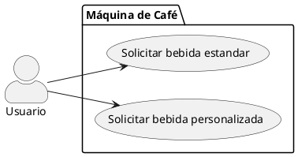
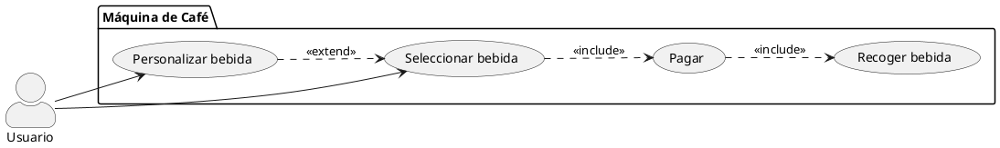
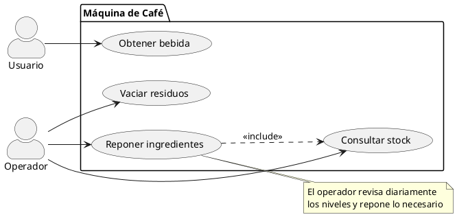
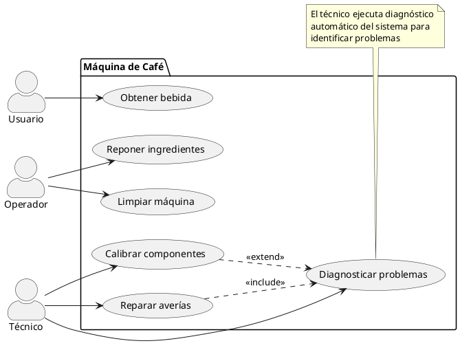
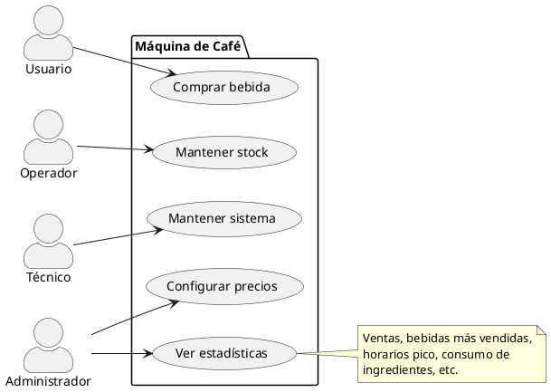
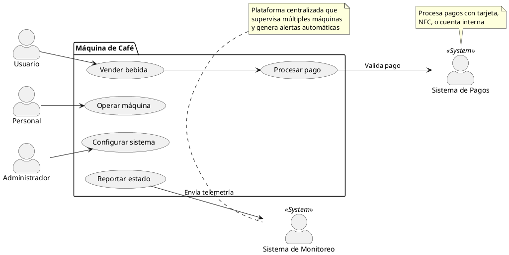
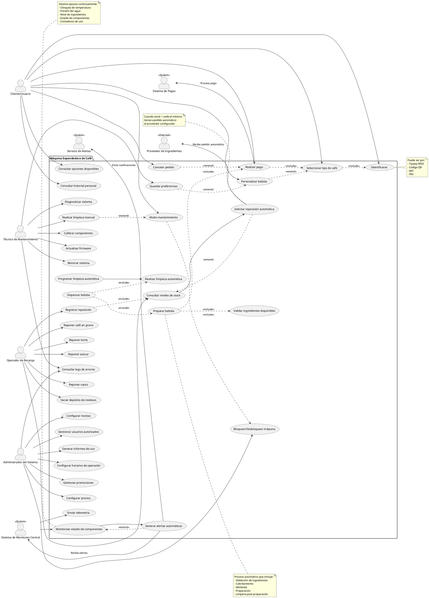

# Diagrama de Casos de Uso - Máquina Expendedora de Café

## Contexto del Sistema

Sistema de software para una máquina expendedora de café profesional ubicada en entornos corporativos u hospitales, con capacidades de telemetría, mantenimiento remoto y gestión de inventario.

---

## Enfoque Progresivo: De Simple a Complejo

Cuando modelamos un sistema, **NO es necesario ni recomendable** meter todo en un único diagrama gigante. El objetivo principal de los diagramas es **facilitar la comunicación y el entendimiento**, no crear documentos exhaustivos imposibles de leer.

Es mucho mejor crear **varios diagramas simples**, cada uno enfocado en un aspecto o perspectiva del sistema, que un único diagrama complejo que nadie entiende.

A continuación mostramos una progresión desde lo más simple hasta lo más completo:

---

## 1. Diagrama Básico - Vista del Usuario Final

Empezamos con lo más simple: **¿Qué puede hacer un usuario con la máquina?**

**Interpretación simple:**
- El usuario puede seleccionar una bebida
- Opcionalmente puede personalizarla
- Debe pagar
- Y finalmente recoge su bebida

Este diagrama es **suficiente** para explicar la funcionalidad básica a un cliente o usuario final.

---

## 2. Diagrama con Operaciones - Vista del Personal

Ahora añadimos las operaciones del personal que mantiene la máquina:

**Interpretación:**
- Los usuarios obtienen bebidas (simplificamos todo el proceso en un solo caso de uso)
- El operador se encarga de mantener la máquina abastecida y limpia

Este diagrama es **suficiente** para explicar las responsabilidades del personal de operación.

---

## 3. Diagrama con Mantenimiento - Vista Técnica

Añadimos la perspectiva del mantenimiento técnico:

**Interpretación:**
- Distinguimos claramente 3 roles: usuario, operador, técnico
- Cada uno tiene responsabilidades diferentes
- El técnico se encarga de aspectos más complejos del mantenimiento

Este diagrama es **suficiente** para explicar las tareas de mantenimiento técnico.

---

## 4. Diagrama con Gestión - Vista Administrativa

Incorporamos la gestión del negocio:

**Interpretación:**
- El administrador gestiona el aspecto de negocio
- Define precios, ve estadísticas
- Este nivel es importante para entender el modelo de negocio

Este diagrama es **suficiente** para una reunión con dirección o gerencia.

---

## 5. Diagrama con Sistemas Externos - Vista de Integración

Mostramos cómo se integra con otros sistemas:

**Interpretación:**
- La máquina no funciona aislada, se integra con sistemas externos
- Sistema de pagos para procesar transacciones
- Sistema de monitoreo para supervisión remota

Este diagrama es **suficiente** para arquitectos y equipos de integración.

---

## Comparación: Simple vs Complejo

### ✅ Ventajas de Diagramas Simples y Múltiples
- **Más fáciles de entender** - cada diagrama cuenta una historia clara
- **Adaptados a la audiencia** - muestro solo lo relevante para cada interesado
- **Mantenibles** - cambios en un aspecto no afectan otros diagramas
- **Útiles en reuniones** - puedo elegir qué mostrar según el contexto
- **Facilitan el diseño incremental** - empiezo simple y voy añadiendo

### ❌ Problemas de Diagramas Complejos
- **Abrumadores** - demasiada información de golpe
- **Difíciles de mantener** - cualquier cambio puede afectar múltiples partes
- **No sirven para comunicar** - nadie los entiende sin explicación extensa
- **Mezclan niveles** - confunden detalles técnicos con conceptos de negocio
- **Pierden el foco** - no está claro qué es lo importante

---

## 📌 Recomendación

**Crea diagramas según necesidad y audiencia:**
- Para clientes/usuarios → Diagrama simple de funcionalidad básica
- Para operadores → Diagrama de operaciones diarias
- Para técnicos → Diagrama de mantenimiento
- Para gerencia → Diagrama de gestión y negocio
- Para arquitectos → Diagrama de integración con sistemas externos
- Para desarrolladores → Diagramas detallados de flujos específicos

**No intentes meter todo en un único diagrama "completo"** - eso va en contra del propósito de usar diagramas.

---

## 7. Diagrama Completo (Solo como Referencia Técnica)

> ⚠️ **ADVERTENCIA**: El siguiente diagrama es muy complejo y **NO debería usarse para comunicación regular**. 
> 
> Solo tiene sentido como **documento de referencia técnica completa** para desarrolladores que necesitan ver todas las funcionalidades del sistema de una vez.
>
> Para cualquier presentación, reunión o explicación, **usa los diagramas simples anteriores**.

Este es el "diagrama monstruo" que incluye absolutamente todo:

---

## Descripción de Actores

### 1. **Cliente/Usuario**
- **Rol**: Consumidor final que utiliza la máquina para obtener bebidas
- **Características**: 
  - Puede ser usuario registrado (con cuenta y preferencias) o usuario anónimo
  - Accede mediante diferentes métodos de identificación
  - Puede tener créditos pre-cargados o pagar por transacción
- **Frecuencia de uso**: Múltiples veces al día

### 2. **Técnico de Mantenimiento**
- **Rol**: Personal especializado responsable del mantenimiento técnico de la máquina
- **Características**:
  - Acceso privilegiado a funciones de diagnóstico y reparación
  - Formación técnica específica del fabricante
  - Puede operar de forma presencial o remota (algunas funciones)
- **Frecuencia de uso**: Semanal/Quincenal o cuando hay alertas

### 3. **Operador de Recarga**
- **Rol**: Personal encargado de reponer ingredientes y materiales consumibles
- **Características**:
  - Puede ser personal interno de la empresa o externo del proveedor
  - Acceso limitado solo a funciones de reposición
  - Registra las reposiciones para control de inventario
- **Frecuencia de uso**: Diaria o según necesidad (alertas de stock bajo)

### 4. **Administrador del Sistema**
- **Rol**: Gestor responsable de la configuración y operación del negocio
- **Características**:
  - Define políticas de precio, horarios y promociones
  - Acceso a informes de negocio y estadísticas
  - Puede gestionar múltiples máquinas desde panel central
- **Frecuencia de uso**: Regular para revisiones y ajustes

### 5. **Sistema de Monitoreo Central** (Sistema Externo)
- **Rol**: Plataforma centralizada que supervisa múltiples máquinas
- **Características**:
  - Recibe telemetría en tiempo real
  - Genera dashboards y alertas
  - Permite gestión remota de flotas de máquinas
- **Interacción**: Continua y automática

### 6. **Sistema de Pagos** (Sistema Externo)
- **Rol**: Pasarela de pago que procesa transacciones
- **Características**:
  - Puede ser sistema de tarjetas, móvil (NFC), o cuenta interna
  - Valida saldo y autoriza transacciones
  - Registra pagos para contabilidad
- **Interacción**: Por cada transacción de venta

### 7. **Proveedor de Ingredientes** (Actor Externo)
- **Rol**: Empresa suministradora de café, leche y consumibles
- **Características**:
  - Recibe pedidos automáticos cuando stock es bajo
  - Integración con sistema de la máquina para gestión JIT (Just In Time)
  - Puede acceder a previsiones de consumo
- **Interacción**: Cuando se activa reposición automática

### 8. **Servicio de Alertas** (Sistema Externo)
- **Rol**: Sistema de notificaciones (email, SMS, push)
- **Características**:
  - Envía alertas a técnicos, operadores o administradores
  - Diferentes niveles de criticidad (info, warning, critical)
  - Canales configurables según tipo de alerta
- **Interacción**: Cuando se generan eventos notificables

---

## Descripción de Casos de Uso Principales

### Casos de Uso del Cliente

#### 1. **Identificarse**
- **Descripción**: El usuario se autentica ante el sistema
- **Precondición**: Usuario tiene credenciales válidas (tarjeta, código, etc.)
- **Flujo básico**: 
  1. Usuario presenta medio de identificación
  2. Sistema valida credenciales
  3. Sistema carga perfil de usuario
- **Postcondición**: Usuario autenticado y sesión iniciada
- **Alternativas**: Usuario anónimo puede proceder sin identificación (sin personalización)

#### 2. **Seleccionar tipo de café**
- **Descripción**: Usuario elige el tipo de bebida deseada
- **Precondición**: Usuario identificado, máquina operativa
- **Flujo básico**:
  1. Sistema muestra opciones disponibles
  2. Usuario selecciona tipo de bebida
  3. Sistema valida disponibilidad de ingredientes
- **Postcondición**: Bebida seleccionada
- **Extensiones**: Personalizar bebida (intensidad, cantidad, temperatura)

#### 3. **Personalizar bebida**
- **Descripción**: Usuario ajusta parámetros de la bebida
- **Precondición**: Bebida seleccionada
- **Opciones**:
  - Intensidad del café (suave, medio, fuerte)
  - Cantidad de leche (poca, normal, extra)
  - Cantidad de azúcar (sin azúcar, 1, 2, 3 sobres)
  - Temperatura (caliente, muy caliente, templado)
  - Tamaño (pequeño, mediano, grande)
- **Postcondición**: Parámetros guardados para esta preparación

#### 4. **Realizar pago**
- **Descripción**: Usuario paga por la bebida seleccionada
- **Precondición**: Bebida seleccionada y personalizada
- **Flujo básico**:
  1. Sistema calcula precio final
  2. Sistema solicita pago
  3. Usuario presenta método de pago
  4. Sistema valida con pasarela de pagos
  5. Sistema confirma pago recibido
- **Postcondición**: Pago autorizado, preparación puede iniciar
- **Alternativas**: 
  - Pago rechazado → cancelar pedido
  - Usar créditos pre-cargados
  - Cuenta corporativa

#### 5. **Preparar bebida**
- **Descripción**: Sistema prepara automáticamente la bebida según especificaciones
- **Precondición**: Pago confirmado, ingredientes disponibles
- **Flujo básico**:
  1. Sistema valida disponibilidad de ingredientes
  2. Sistema activa componentes necesarios (calentadores, molinillo, etc.)
  3. Sistema ejecuta receta correspondiente
  4. Sistema monitorea proceso
  5. Sistema finaliza preparación
- **Postcondición**: Bebida lista para dispensar
- **Inclusiones**: Validar ingredientes, Limpieza automática

#### 6. **Guardar preferencias**
- **Descripción**: Usuario guarda su configuración favorita
- **Precondición**: Usuario identificado (no anónimo)
- **Flujo básico**:
  1. Después de personalizar, sistema ofrece guardar
  2. Usuario confirma guardado
  3. Sistema almacena preferencias en perfil
- **Postcondición**: Próxima vez, sistema sugiere estas preferencias
- **Beneficio**: Pedidos más rápidos en futuras ocasiones

### Casos de Uso del Técnico de Mantenimiento

#### 7. **Diagnosticar sistema**
- **Descripción**: Técnico ejecuta diagnóstico completo de la máquina
- **Precondición**: Técnico autenticado con credenciales de mantenimiento
- **Flujo básico**:
  1. Técnico inicia modo diagnóstico
  2. Sistema ejecuta tests de todos los componentes:
     - Calentadores (temperatura alcanzada)
     - Bombas (presión correcta)
     - Molinillo (velocidad y calidad)
     - Sensores (lecturas coherentes)
     - Dispensadores (funcionamiento)
  3. Sistema genera reporte de diagnóstico
  4. Sistema identifica componentes con fallos o desgaste
- **Postcondición**: Reporte disponible, problemas identificados
- **Variantes**: Diagnóstico rápido vs. diagnóstico exhaustivo

#### 8. **Calibrar componentes**
- **Descripción**: Técnico ajusta parámetros operativos de componentes
- **Precondición**: Diagnóstico completado, máquina en modo mantenimiento
- **Componentes calibrables**:
  - Molinillo (grosor de molienda)
  - Temperatura de agua (offset)
  - Presión de bomba
  - Dosificación de ingredientes
  - Sensores de nivel
- **Flujo básico**:
  1. Técnico selecciona componente
  2. Sistema muestra valores actuales
  3. Técnico ajusta parámetros
  4. Sistema valida con test
  5. Técnico confirma calibración
- **Postcondición**: Componente calibrado correctamente

#### 9. **Actualizar firmware**
- **Descripción**: Técnico instala nueva versión de software del sistema
- **Precondición**: Máquina en modo mantenimiento, firmware disponible
- **Flujo básico**:
  1. Técnico carga archivo de firmware
  2. Sistema valida integridad del archivo
  3. Sistema crea backup de configuración actual
  4. Sistema instala nuevo firmware
  5. Sistema reinicia con nueva versión
  6. Sistema valida funcionamiento post-actualización
- **Postcondición**: Sistema operando con nueva versión
- **Seguridad**: Proceso no interrumpible, con rollback automático si falla

#### 10. **Consultar logs de errores**
- **Descripción**: Técnico o administrador revisa historial de errores del sistema
- **Precondición**: Credenciales de mantenimiento o administración
- **Información disponible**:
  - Timestamp de cada error
  - Código de error
  - Componente afectado
  - Descripción del problema
  - Acciones tomadas por el sistema
  - Contexto (temperatura, presión, contador de usos, etc.)
- **Filtros**: Por fecha, por tipo de error, por componente, por severidad
- **Postcondición**: Técnico tiene información para resolver problemas recurrentes

### Casos de Uso del Operador de Recarga

#### 11. **Consultar niveles de stock**
- **Descripción**: Operador verifica qué ingredientes necesitan reposición
- **Precondición**: Operador autenticado
- **Información mostrada**:
  - Nivel actual de cada ingrediente (%)
  - Cantidad en unidades físicas
  - Proyección de consumo (días restantes)
  - Umbral mínimo configurado
  - Última fecha de reposición
- **Indicadores**: Colores (verde, amarillo, rojo) según nivel
- **Postcondición**: Operador sabe qué reponer

#### 12. **Reponer café en grano**
- **Descripción**: Operador rellena el depósito de café en grano
- **Precondición**: Operador autenticado, acceso físico al depósito
- **Flujo básico**:
  1. Operador abre compartimento de café
  2. Sistema detecta apertura
  3. Operador vacía bolsa de café en depósito
  4. Operador cierra compartimento
  5. Sistema detecta cierre y mide nuevo nivel
  6. Sistema solicita confirmar cantidad repuesta
  7. Operador confirma (escanea código de lote)
  8. Sistema registra reposición con timestamp y lote
- **Postcondición**: Stock actualizado, trazabilidad registrada
- **Similar para**: Leche, azúcar, vasos

#### 13. **Vaciar depósito de residuos**
- **Descripción**: Operador retira poso de café usado y limpia depósito
- **Precondición**: Depósito de residuos lleno o cerca del límite
- **Flujo básico**:
  1. Sistema alerta que depósito está al 80-90%
  2. Operador abre compartimento de residuos
  3. Sistema bloquea operación de la máquina
  4. Operador retira y vacía depósito
  5. Operador limpia y reinserta depósito
  6. Sistema detecta reinserción
  7. Sistema resetea contador de residuos
  8. Sistema desbloquea máquina
- **Postcondición**: Máquina lista para operar, contador reseteado

#### 14. **Registrar reposición**
- **Descripción**: Sistema documenta automáticamente cada reposición
- **Inclusión**: Se ejecuta automáticamente con cada reposición
- **Datos registrados**:
  - Fecha y hora
  - Ingrediente repuesto
  - Cantidad añadida
  - Operador que realizó la reposición
  - Lote/batch del ingrediente (trazabilidad)
  - Nivel antes y después
- **Uso posterior**: Informes de consumo, auditorías, gestión de inventario

### Casos de Uso del Administrador

#### 15. **Configurar precios**
- **Descripción**: Administrador define precios de cada tipo de bebida
- **Precondición**: Administrador autenticado
- **Configuraciones**:
  - Precio base por tipo de bebida
  - Incrementos por personalizaciones (extra leche, tamaño grande)
  - Descuentos por volumen (tarjetas de crédito recargable)
  - Precios diferenciados por horario (happy hour)
- **Flujo básico**:
  1. Admin selecciona bebida
  2. Admin establece precio
  3. Sistema valida precio (dentro de rangos permitidos)
  4. Admin confirma
  5. Sistema aplica nuevo precio inmediatamente
- **Postcondición**: Precios actualizados en el sistema

#### 16. **Generar informes de uso**
- **Descripción**: Administrador obtiene estadísticas y reportes del negocio
- **Precondición**: Administrador autenticado, datos históricos disponibles
- **Tipos de informes**:
  - **Ventas**: Total de ventas por día/semana/mes, ingresos
  - **Bebidas más vendidas**: Ranking de preferencias
  - **Consumo de ingredientes**: Proyecciones de reposición
  - **Horarios pico**: Momentos de mayor demanda
  - **Usuarios frecuentes**: Top consumidores (si identificados)
  - **Fallos y downtime**: Tiempo fuera de servicio
- **Formatos**: PDF, Excel, CSV, visualización en pantalla
- **Postcondición**: Información para toma de decisiones de negocio

#### 17. **Configurar horarios de operación**
- **Descripción**: Administrador define cuándo la máquina está activa
- **Precondición**: Administrador autenticado
- **Configuraciones**:
  - Horario de operación por día de la semana
  - Festivos (días que permanece apagada)
  - Horarios de limpieza programada
  - Modo energía reducida en horarios de baja demanda
- **Ejemplo**: Lunes a Viernes 7:00-19:00, Sábados 9:00-14:00, Domingos cerrado
- **Postcondición**: Máquina se enciende/apaga automáticamente según horario

#### 18. **Gestionar promociones**
- **Descripción**: Administrador crea campañas promocionales
- **Tipos de promociones**:
  - 2x1 en horarios específicos
  - Descuento para usuarios frecuentes
  - Bebida gratis cada N compras
  - Puntos de fidelización
  - Precios especiales para grupos/departamentos
- **Configuración**:
  - Período de validez
  - Condiciones de aplicación
  - Límites (máximo por usuario/día)
- **Postcondición**: Promoción activa, sistema la aplica automáticamente

### Casos de Uso del Sistema (Automáticos)

#### 19. **Monitorear estado de componentes**
- **Descripción**: Sistema supervisa continuamente todos los componentes
- **Ejecución**: Continua en background, cada X segundos
- **Monitorización**:
  - Temperatura de calentadores (rango normal 90-96°C)
  - Presión de bomba (rango normal 9-15 bar)
  - Velocidad de molinillo
  - Niveles de ingredientes
  - Estado de sensores
  - Contadores de ciclos de uso
  - Consumo eléctrico
- **Postcondición**: Datos de telemetría actualizados
- **Trigger para**: Generar alertas si valores fuera de rango

#### 20. **Generar alertas automáticas**
- **Descripción**: Sistema crea alertas cuando detecta situaciones anormales
- **Trigger**: Monitorización detecta anomalía
- **Tipos de alertas**:
  - **Críticas**: Fallo de componente, máquina inoperativa
  - **Advertencias**: Ingrediente bajo, necesita calibración
  - **Informativas**: Limpieza programada próxima, fin de horario
- **Destinatarios según tipo**:
  - Técnico: fallos técnicos
  - Operador: stock bajo, residuos llenos
  - Administrador: problemas que afectan ingresos
- **Canales**: Email, SMS, push notification, dashboard central
- **Postcondición**: Personal notificado, alerta registrada en log

#### 21. **Solicitar reposición automática**
- **Descripción**: Sistema genera pedido automático al proveedor cuando stock es bajo
- **Precondición**: Integración con proveedor configurada, umbrales definidos
- **Trigger**: Nivel de ingrediente < umbral mínimo
- **Flujo básico**:
  1. Sistema detecta stock bajo (ej: café < 10%)
  2. Sistema calcula cantidad a pedir (basado en consumo promedio)
  3. Sistema genera orden de compra
  4. Sistema envía orden al proveedor vía API/email
  5. Sistema notifica a administrador
  6. Sistema marca pedido como "pendiente"
- **Postcondición**: Pedido enviado, esperando entrega
- **Beneficio**: Gestión JIT, nunca se queda sin ingredientes

#### 22. **Programar limpieza automática**
- **Descripción**: Sistema agenda y ejecuta limpiezas según políticas configuradas
- **Políticas de limpieza**:
  - Cada N bebidas preparadas (ej: cada 50)
  - Cada N horas de operación (ej: cada 8h)
  - Al final del día (antes de apagarse)
  - Cuando tiempo en reposo > X minutos (limpieza preventiva)
- **Tipos de limpieza**:
  - Rápida: Enjuague de circuitos (2-3 min)
  - Exhaustiva: Limpieza completa con descalcificación (15-20 min)
- **Ejecución**: Automática en momentos de baja demanda
- **Postcondición**: Máquina limpia, lista para operar

---

## Relaciones entre Casos de Uso

### Relaciones **<<include>>** (Obligatorias)

Indican que un caso de uso **siempre** incluye el comportamiento de otro:

1. **`Seleccionar tipo de café` <<include>> `Identificarse`**
   - Para seleccionar café, el usuario debe estar identificado (aunque sea como anónimo)

2. **`Preparar bebida` <<include>> `Validar ingredientes`**
   - Antes de preparar, el sistema debe verificar que hay ingredientes suficientes

3. **`Realizar pago` <<include>> `Seleccionar café`**
   - No se puede pagar sin haber seleccionado una bebida primero

4. **`Preparar bebida` <<include>> `Realizar pago`**
   - La preparación solo inicia si el pago fue exitoso

5. **`Dispensar bebida` <<include>> `Preparar bebida`**
   - Para dispensar, la bebida debe haberse preparado

6. **`Dispensar bebida` <<include>> `Limpieza automática`**
   - Después de cada dispensación, se ejecuta limpieza (puede ser ligera)

7. **`Registrar reposición` <<include>> `Consultar stock`**
   - Al registrar reposición, se debe leer primero el nivel actual

8. **`Modo mantenimiento` <<include>> `Bloquear máquina`**
   - Al entrar en mantenimiento, la máquina se bloquea para uso normal

### Relaciones **<<extend>>** (Opcionales/Condicionales)

Indican que un caso de uso **puede** extender a otro bajo ciertas condiciones:

1. **`Personalizar bebida` <<extend>> `Seleccionar café`**
   - Después de seleccionar, el usuario *puede opcionalmente* personalizar

2. **`Cancelar pedido` <<extend>> `Realizar pago`**
   - Durante el proceso de pago, el usuario *puede* cancelar

3. **`Guardar preferencias` <<extend>> `Personalizar bebida`**
   - Después de personalizar, el usuario *puede* guardar como favorito

4. **`Limpieza manual` <<extend>> `Modo mantenimiento`**
   - Durante mantenimiento, técnico *puede* ejecutar limpieza manual extra

5. **`Generar alertas` <<extend>> `Monitorear`**
   - Durante monitoreo, *si* se detecta anomalía, se generan alertas

6. **`Solicitar reposición` <<extend>> `Consultar stock`**
   - Al consultar stock, *si* nivel < umbral, se solicita reposición automática

---

## Notas Adicionales del Diagrama

### Nota sobre Identificación
Múltiples métodos de autenticación:
- **Tarjeta RFID**: Empleados con tarjeta corporativa
- **Código QR**: Generado en app móvil del usuario
- **NFC**: Pago y autenticación con smartphone
- **PIN**: Código numérico personal
- **Anónimo**: Sin identificación (sin personalización ni historial)

### Nota sobre Preparación
Proceso automático complejo:
1. **Validación**: Ingredientes, pago, máquina operativa
2. **Calentamiento**: Agua y leche a temperatura óptima (paralelo)
3. **Molienda**: Café en grano → café molido (cantidad exacta)
4. **Extracción**: Agua + café molido → café líquido (presión/tiempo controlados)
5. **Mezclado**: Café + leche + azúcar según personalización
6. **Dispensación**: Servir en vaso del tamaño seleccionado
7. **Limpieza**: Enjuague automático de circuitos

### Nota sobre Monitoreo Continuo
El sistema ejecuta permanentemente:
- **Chequeo de temperatura**: Calentadores dentro de rango
- **Presión del agua**: Bomba funcionando correctamente
- **Nivel de ingredientes**: Stock suficiente para próximas bebidas
- **Estado de componentes**: Detectar desgaste o fallos inminentes
- **Contadores de uso**: Ciclos de molinillo, bomba, calentadores
- **Calidad de agua**: Dureza (para programar descalcificación)

### Nota sobre Reposición Automática
Lógica inteligente:
- **Umbral mínimo**: Ej. Café < 10% → generar alerta
- **Umbral crítico**: Ej. Café < 5% → generar pedido automático
- **Cálculo predictivo**: Basado en consumo promedio de últimos 7 días
- **Cantidad a pedir**: Suficiente para X días de operación
- **Integración con proveedor**: API o email automático con formato estándar
- **Confirmación**: Proveedor responde con fecha estimada de entrega

---

## Priorización de Casos de Uso para Desarrollo

### **Fase 1 - MVP (Producto Mínimo Viable)**
Casos de uso esenciales para operación básica:
1. Identificarse (básico: anónimo)
2. Seleccionar tipo de café
3. Realizar pago (manual/tarjeta)
4. Preparar bebida
5. Dispensar bebida
6. Limpieza automática (básica)
7. Consultar niveles de stock (manual)
8. Reponer ingredientes (manual)

### **Fase 2 - Mejoras Operativas**
Casos de uso para mejor experiencia y mantenimiento:
1. Personalizar bebida
2. Consultar opciones disponibles
3. Diagnosticar sistema
4. Consultar logs de errores
5. Vaciar depósito de residuos
6. Configurar precios
7. Monitorear estado de componentes
8. Generar alertas automáticas

### **Fase 3 - Características Avanzadas**
Casos de uso para fidelización y gestión:
1. Guardar preferencias
2. Consultar historial personal
3. Gestionar promociones
4. Generar informes de uso
5. Calibrar componentes
6. Actualizar firmware
7. Registrar reposición (trazabilidad completa)
8. Configurar horarios de operación

### **Fase 4 - Integración y Automatización**
Casos de uso para operación inteligente:
1. Enviar telemetría
2. Solicitar reposición automática
3. Programar limpieza automática
4. Gestionar usuarios autorizados
5. Configurar recetas
6. Bloquear/Desbloquear máquina remotamente
7. Modo mantenimiento remoto

---

## Conclusión

Este diagrama de casos de uso muestra un **sistema completo de máquina expendedora de café profesional** con capacidades de:

- ✅ **Operación autónoma**: Usuarios pueden obtener bebidas sin intervención
- ✅ **Gestión inteligente**: Monitoreo continuo y alertas proactivas
- ✅ **Mantenimiento predictivo**: Diagnóstico y calibración para prevenir fallos
- ✅ **Gestión de negocio**: Precios, promociones, informes de ventas
- ✅ **Integración externa**: Sistemas de pago, proveedores, monitoreo central
- ✅ **Trazabilidad completa**: Registro de ingredientes, mantenimiento, uso

El sistema balances **automatización** (preparación, limpieza, alertas) con **control humano** (mantenimiento, reposición, configuración estratégica), creando una solución robusta para entornos corporativos de alto tráfico.
