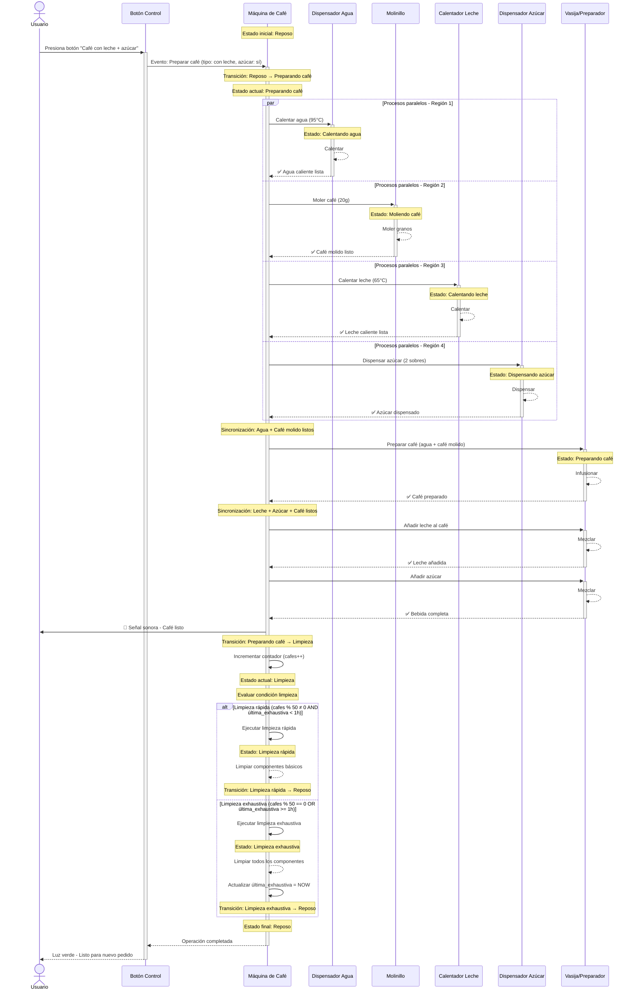

# Diagrama de Secuencia: Interacción con Máquina Expendedora de Café

## Escenario: Usuario solicita un café con leche y azúcar



---

## Diferencias Conceptuales Fundamentales entre Diagramas de Estados y Diagramas de Secuencia

### 1. **Propósito y Objetivo del Modelado**

#### Diagrama de Estados (State Machine Diagram)
- **Propósito**: Modelar el **comportamiento interno** de un único objeto o sistema a lo largo del tiempo.
- **Enfoque**: Describe **QUÉ estados** puede adoptar un objeto y **CÓMO cambia** de un estado a otro.
- **Perspectiva**: Vista **introspectiva** del sistema - miramos hacia adentro de la máquina.
- **Pregunta que responde**: "¿En qué situaciones diferentes puede encontrarse este sistema y cómo transita entre ellas?"

#### Diagrama de Secuencia (Sequence Diagram)
- **Propósito**: Modelar la **interacción y comunicación** entre múltiples objetos/actores a lo largo del tiempo.
- **Enfoque**: Describe **CÓMO colaboran** diferentes elementos del sistema para realizar una funcionalidad.
- **Perspectiva**: Vista **de colaboración** - miramos las relaciones y mensajes entre componentes.
- **Pregunta que responde**: "¿Qué mensajes se intercambian entre los participantes y en qué orden para lograr un objetivo?"

---

### 2. **Dimensión Temporal**

#### Diagrama de Estados
- **Tiempo abstracto y no lineal**: El tiempo no fluye necesariamente de forma secuencial.
- **Permanencia en estados**: Un sistema puede permanecer en un estado durante períodos indefinidos hasta que ocurra un evento.
- **Eventos como disparadores**: Las transiciones ocurren cuando se producen eventos específicos, no necesariamente en un orden temporal predecible.
- **No hay línea de tiempo explícita**: El diagrama muestra posibilidades de transición, no una secuencia temporal concreta.

**Ejemplo**: La máquina puede estar en "Reposo" durante 5 minutos o 5 horas - el diagrama no especifica cuánto tiempo, solo que está en ese estado hasta que algo la saque de él.

#### Diagrama de Secuencia
- **Tiempo lineal y explícito**: El tiempo fluye de arriba hacia abajo de forma estrictamente secuencial.
- **Cronología de eventos**: Cada mensaje tiene un momento específico en la línea temporal.
- **Orden estricto**: La posición vertical de cada mensaje indica exactamente cuándo ocurre en relación con otros mensajes.
- **Duración de activaciones**: Las barras de activación muestran cuánto "dura" el procesamiento de un mensaje.

**Ejemplo**: Primero se calienta el agua (mensaje 1), luego se muele el café (mensaje 2), después se prepara (mensaje 3) - el orden es absoluto y específico.

---

### 3. **Alcance y Granularidad**

#### Diagrama de Estados
- **Alcance**: Modelo **completo del ciclo de vida** de un objeto/sistema.
- **Cobertura**: Representa **TODOS los estados posibles** y **TODAS las transiciones posibles**.
- **Generalidad**: Modelo genérico que aplica a cualquier ejecución del sistema.
- **Exhaustividad**: Debe cubrir todos los caminos posibles, incluyendo casos excepcionales.

**Ejemplo en la máquina de café**: El diagrama muestra que la máquina puede estar Apagada/Encendida/Reposo/Preparando/Limpieza - SIEMPRE. Es una descripción completa de todas sus posibilidades.

#### Diagrama de Secuencia
- **Alcance**: Modelo de **UN escenario específico** o caso de uso concreto.
- **Cobertura**: Representa **UNA interacción particular** entre objetos.
- **Especificidad**: Modelo concreto de una ejecución específica del sistema.
- **Selectividad**: Muestra solo los mensajes relevantes para explicar un escenario particular.

**Ejemplo en la máquina de café**: El diagrama muestra solo QUÉ pasa cuando un usuario pide UN café con leche y azúcar - es UN caso particular, no todos los casos posibles.

---

### 4. **Elementos Centrales del Modelo**

#### Diagrama de Estados
**Elementos principales:**
1. **Estados**: Situaciones estables en las que se encuentra el sistema
   - Nombrados con sustantivos o participios/gerundios
   - Ejemplo: "Reposo", "Calentando", "Preparando café"

2. **Transiciones**: Cambios instantáneos de un estado a otro
   - Nombradas con verbos en infinitivo
   - Ejemplo: "Encender", "Preparar café", "Finalizar limpieza"

3. **Eventos**: Estímulos externos o internos que disparan transiciones
   - Ejemplo: Pulsar botón, timer expira, contador alcanza valor

4. **Guardias**: Condiciones booleanas que permiten o bloquean transiciones
   - Ejemplo: `[cafes % 50 == 0]`, `[temperatura >= 95°C]`

5. **Acciones/Efectos**: Operaciones que se ejecutan durante las transiciones
   - Ejemplo: `cafes++`, `ultima = NOW`

6. **Estados compuestos**: Estados que contienen sub-estados
   - Ejemplo: "Encendida" contiene "Reposo", "Preparando café", "Limpieza"

7. **Regiones paralelas**: Estados simultáneos independientes
   - Ejemplo: Calentar agua || Moler café || Calentar leche

#### Diagrama de Secuencia
**Elementos principales:**
1. **Participantes/Actores**: Objetos o personas que intercambian mensajes
   - Representados en la parte superior
   - Ejemplo: Usuario, Máquina, Dispensador, Molinillo

2. **Líneas de vida (lifelines)**: Líneas verticales que representan la existencia del participante en el tiempo
   - Muestran cuándo existe cada participante

3. **Mensajes**: Comunicaciones entre participantes
   - Síncronos (`->>`) : emisor espera respuesta
   - Asíncronos (`-->>`) : emisor no espera respuesta
   - Respuestas: mensajes de retorno

4. **Activaciones**: Barras rectangulares que muestran cuándo un participante está procesando
   - Representan el tiempo que un objeto está "activo" ejecutando lógica

5. **Fragmentos combinados**: Estructuras de control (alt, opt, loop, par)
   - `par`: Ejecución paralela
   - `alt`: Alternativas condicionales
   - `loop`: Repeticiones
   - `opt`: Opcional

6. **Notas**: Comentarios explicativos sobre el estado del sistema en momentos específicos
   - Ejemplo: "Estado actual: Preparando café"

---

### 5. **Naturaleza del Modelado**

#### Diagrama de Estados
- **Naturaleza**: Modelo **declarativo y reactivo**
- **Comportamiento**: El sistema **reacciona** a eventos externos/internos
- **Control**: El sistema es **pasivo** - espera que ocurran eventos
- **Lógica**: Basada en **condiciones y guardias** - "SI estoy en X estado Y ocurre Z evento, ENTONCES voy a W estado"
- **Abstracción**: Alto nivel de abstracción - no muestra detalles de implementación de las acciones

**Analogía**: Es como un **mapa de posibilidades** - muestra todos los caminos que puedes tomar, pero no dice cuál tomarás.

#### Diagrama de Secuencia
- **Naturaleza**: Modelo **imperativo y proactivo**
- **Comportamiento**: Los objetos **ejecutan activamente** operaciones y envían mensajes
- **Control**: Los objetos son **activos** - toman iniciativa para comunicarse
- **Lógica**: Basada en **flujo de mensajes** - "Haz esto, luego aquello, después lo otro"
- **Concreción**: Muestra detalles específicos de la interacción - qué parámetros se pasan, qué respuestas se reciben

**Analogía**: Es como un **guion de teatro** - describe exactamente qué dice cada actor y cuándo lo dice en una obra concreta.

---

### 6. **Manejo de Concurrencia y Paralelismo**

#### Diagrama de Estados
- **Concurrencia**: Representada mediante **regiones paralelas** dentro de estados compuestos
- **Significado**: El sistema puede estar simultáneamente en múltiples estados (uno por región)
- **Sintaxis**: Separadores `--` en Mermaid para dividir regiones
- **Semántica**: Estados ortogonales - independientes entre sí, sin relación de orden
- **Ejemplo**: Mientras calienta agua (región 1), también puede estar moliendo café (región 2) - ambos estados activos simultáneamente

```mermaid
state ParalelState {
    [*] --> ProcesoA
    --
    [*] --> ProcesoB
}
```

#### Diagrama de Secuencia
- **Concurrencia**: Representada mediante fragmento **`par`** (parallel)
- **Significado**: Varios mensajes se envían simultáneamente sin esperar respuestas
- **Sintaxis**: Bloque `par ... and ... and ... end`
- **Semántica**: Mensajes que se disparan al mismo tiempo pero se procesan independientemente
- **Sincronización**: Se puede mostrar puntos de sincronización donde se esperan todas las respuestas

```mermaid
par Paralelo
    A ->> B: Mensaje 1
and
    A ->> C: Mensaje 2
and
    A ->> D: Mensaje 3
end
```

**Diferencia clave**: 
- En estados, la concurrencia es sobre **estar en múltiples situaciones** simultáneamente
- En secuencia, la concurrencia es sobre **ejecutar múltiples acciones** simultáneamente

---

### 7. **Condiciones y Decisiones**

#### Diagrama de Estados
- **Mecanismo**: **Guardias en transiciones** `[condición]`
- **Evaluación**: Cuando se dispara un evento, se evalúan las guardias para determinar qué transición ejecutar
- **Representación visual**: Estados tipo `<<choice>>` para decisiones complejas
- **Contexto**: Las condiciones dependen del **estado extendido** (propiedades/variables del sistema)
- **Ejemplo**: `[cafes % 50 == 0]` - la transición solo ocurre si el contador es múltiplo de 50

**Característica**: Las decisiones son **implícitas en las guardias** - no hay flujo de control explícito, sino reglas que determinan qué transición es válida.

#### Diagrama de Secuencia
- **Mecanismo**: Fragmentos **`alt`** (alternative) o **`opt`** (optional)
- **Evaluación**: Flujo de control explícito que bifurca según condiciones
- **Representación visual**: Rectángulos con regiones separadas por líneas discontinuas
- **Contexto**: Las condiciones se evalúan en el momento de la ejecución del escenario
- **Ejemplo**: 
```mermaid
alt Limpieza rápida
    ...mensajes para limpieza rápida...
else Limpieza exhaustiva
    ...mensajes para limpieza exhaustiva...
end
```

**Característica**: Las decisiones son **explícitas en el flujo** - se ve claramente la bifurcación y los caminos alternativos.

---

### 8. **Relación con Casos de Uso**

#### Diagrama de Estados
- **Relación**: Describe el **comportamiento global** de un objeto a través de MÚLTIPLES casos de uso
- **Cobertura**: Un diagrama de estados puede abarcar el comportamiento necesario para varios casos de uso
- **Granularidad**: Más abstracto - no se mapea uno-a-uno con casos de uso
- **Ejemplo**: El diagrama de estados de la máquina de café cubre los casos de uso "Preparar café", "Hacer mantenimiento", "Encender/Apagar máquina", etc.

#### Diagrama de Secuencia
- **Relación**: Describe la **realización específica** de UN caso de uso (o escenario dentro de un caso de uso)
- **Cobertura**: Típicamente un diagrama de secuencia por cada flujo importante de un caso de uso
- **Granularidad**: Más concreto - relación casi uno-a-uno con escenarios
- **Ejemplo**: El diagrama de secuencia muestra específicamente "Usuario pide café con leche y azúcar" - un escenario concreto del caso de uso "Preparar café"

---

### 9. **Información sobre Participantes**

#### Diagrama de Estados
- **Perspectiva**: **Mono-objeto** - se centra en UN único objeto o sistema
- **Visibilidad**: Solo se ve el comportamiento interno de ese objeto
- **Colaboradores**: Los demás objetos son invisibles - solo se ven como fuentes de eventos
- **Encapsulamiento**: Enfatiza la **autonomía** del objeto - es una caja negra que reacciona a estímulos

**En el ejemplo**: Solo vemos la máquina de café como un todo. No vemos que internamente tiene dispensadores, molinillo, etc. - esos son detalles internos abstraídos en estados.

#### Diagrama de Secuencia
- **Perspectiva**: **Multi-objeto** - muestra la colaboración entre VARIOS objetos
- **Visibilidad**: Se ve la interacción externa entre objetos
- **Colaboradores**: Todos los participantes son visibles y explícitos
- **Descomposición**: Enfatiza la **colaboración** - se abre la caja negra para ver los componentes y cómo se comunican

**En el ejemplo**: Vemos Usuario, Máquina, Dispensador, Molinillo, Calentador - todos son actores explícitos que se envían mensajes.

---

### 10. **Reutilización y Composición**

#### Diagrama de Estados
- **Composición**: Estados compuestos permiten **jerarquía** y **sub-máquinas**
- **Reutilización**: Un sub-estado puede ser una máquina de estados completa
- **Encapsulamiento**: Los detalles internos de estados compuestos están ocultos en niveles superiores
- **Ejemplo**: El estado "Preparando café" es un estado compuesto que internamente tiene su propia máquina de estados con regiones paralelas

#### Diagrama de Secuencia
- **Composición**: Fragmentos `ref` permiten **referenciar otros diagramas**
- **Reutilización**: Secuencias comunes se pueden extraer y referenciar
- **Modularización**: Interacciones complejas se pueden dividir en múltiples diagramas
- **Ejemplo**: Se podría tener un diagrama "Preparar café base" que se referencia desde "Preparar café con leche"

---

### 11. **Validación y Verificación**

#### Diagrama de Estados
- **Validación**: Se verifica **completitud** - ¿están todos los estados posibles? ¿todas las transiciones necesarias?
- **Propiedades verificables**:
  - Alcanzabilidad: ¿Se puede llegar a todos los estados?
  - Vivacidad: ¿Hay estados trampa sin salida?
  - Determinismo: ¿Hay transiciones ambiguas con el mismo evento?
- **Análisis formal**: Permite análisis matemático de propiedades del sistema
- **Herramientas**: Model checkers pueden verificar propiedades automáticamente

#### Diagrama de Secuencia
- **Validación**: Se verifica **coherencia** - ¿los mensajes tienen sentido? ¿el orden es lógico?
- **Propiedades verificables**:
  - Completitud de mensajes: ¿Todos los mensajes tienen respuesta si es necesario?
  - Sincronización: ¿Las activaciones concuerdan con mensajes?
  - Alternativas: ¿Los casos alternativos cubren todos los escenarios?
- **Análisis**: Más cualitativo - revisión humana de la lógica
- **Trazabilidad**: Permite verificar que el diseño implementa los requisitos

---

### 12. **Uso en el Ciclo de Desarrollo**

#### Diagrama de Estados
- **Fase**: Principalmente en **diseño detallado** y **arquitectura**
- **Aplicación**: 
  - Diseño de **protocolos de comunicación**
  - Sistemas de **control embebido**
  - **Gestión de sesiones** (login, transacciones)
  - **Interfaces de usuario** reactivas
  - **Workflows complejos** con múltiples estados
- **Audiencia**: Desarrolladores, arquitectos, testers que necesitan entender el comportamiento completo
- **Longevidad**: Documento de referencia durante toda la vida del sistema

#### Diagrama de Secuencia
- **Fase**: Desde **análisis** hasta **diseño** y **documentación**
- **Aplicación**:
  - **Análisis de requisitos** - entender flujos de casos de uso
  - **Diseño de APIs** - definir contratos entre componentes
  - **Debugging** - entender interacciones problemáticas
  - **Documentación** - explicar cómo funciona el sistema
  - **Comunicación con stakeholders** - más fácil de entender que código
- **Audiencia**: Analistas, clientes, desarrolladores, testers - más universal
- **Longevidad**: Documentos vivos que se crean/actualizan según necesidad

---

## Resumen Conceptual: ¿Cuándo usar cada uno?

### Usa Diagrama de Estados cuando:
1. Necesitas modelar el **ciclo de vida completo** de un objeto
2. El objeto tiene comportamiento que **depende fuertemente de su historia** (estado previo)
3. Trabajas con sistemas **reactivos** o de **control**
4. Necesitas representar **comportamiento concurrente complejo** dentro de un objeto
5. Quieres **validar formalmente** propiedades del sistema (alcanzabilidad, vivacidad, etc.)
6. El objeto pasa por **fases claramente diferenciadas**

**Ejemplo típico**: Conexión TCP/IP (SYN_SENT, ESTABLISHED, FIN_WAIT, CLOSED...), Pedido (Pendiente, Procesando, Enviado, Entregado, Cancelado)

### Usa Diagrama de Secuencia cuando:
1. Necesitas mostrar **cómo colaboran múltiples objetos** para lograr algo
2. Quieres documentar **un flujo específico** de un caso de uso
3. Necesitas **diseñar o entender APIs** y protocolos de comunicación
4. Quieres explicar **interacciones complejas** de forma visual
5. Estás en **análisis de requisitos** y necesitas validar entendimiento con el cliente
6. Necesitas **debugging conceptual** - entender por qué algo falla

**Ejemplo típico**: Proceso de checkout en e-commerce (Usuario → Frontend → Backend → Pasarela de pago → Email service)

---

## Complementariedad

**Ambos diagramas son complementarios, NO excluyentes**:

- El **diagrama de estados** de la máquina de café te dice QUÉ estados tiene y CUÁNDO cambia de estado
- El **diagrama de secuencia** te dice CÓMO esos cambios de estado se materializan a través de la comunicación entre los componentes internos

Un buen diseño usa ambos:
1. **Diagrama de estados** para entender el comportamiento global y las reglas de transición
2. **Diagramas de secuencia** para detallar cómo se implementan las transiciones importantes o complejas

En nuestro ejemplo:
- El diagrama de estados nos dice que al preparar un café, pasamos por estados de calentamiento, molienda, preparación y limpieza
- El diagrama de secuencia nos muestra exactamente qué mensajes se intercambian entre los componentes para realizar esa preparación, en qué orden, y cómo se sincronizan

**Juntos proporcionan una visión completa**: el estado da la vista "estratégica" (qué puede hacer el sistema), la secuencia da la vista "táctica" (cómo lo hace en la práctica).
