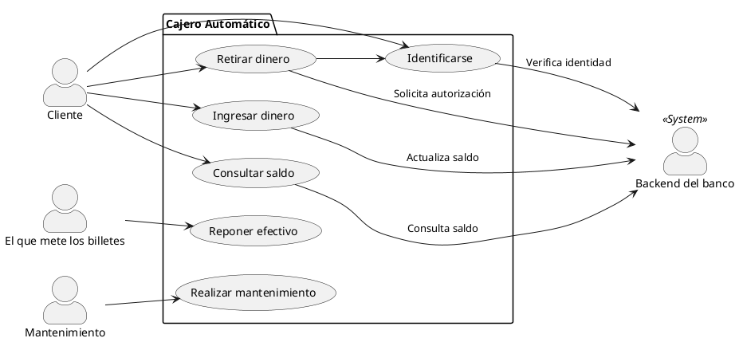
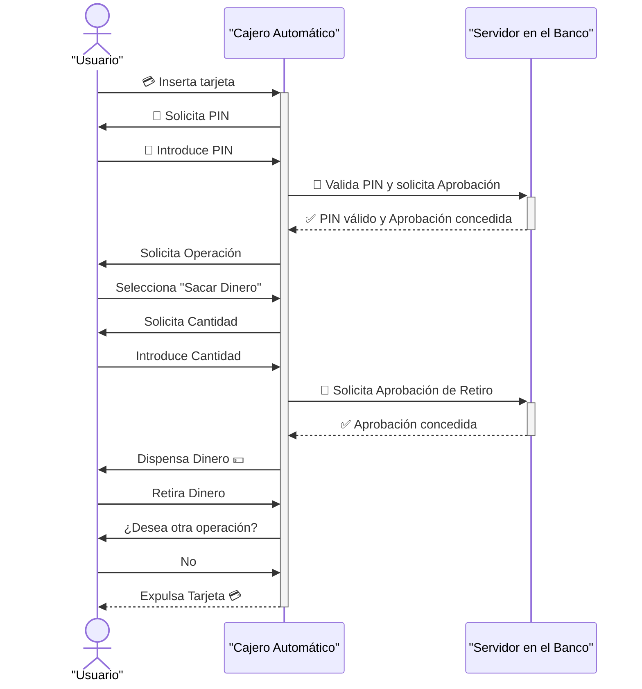
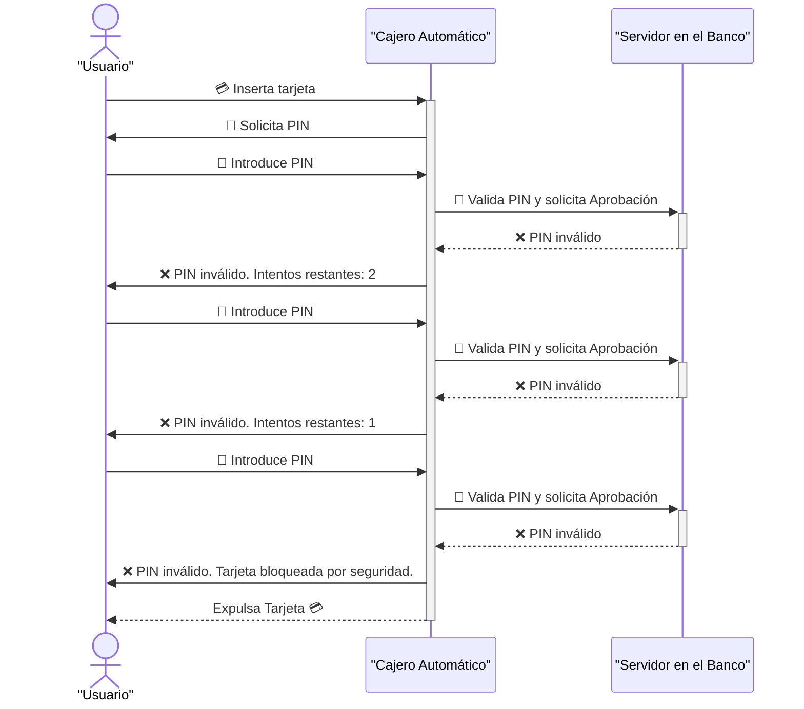
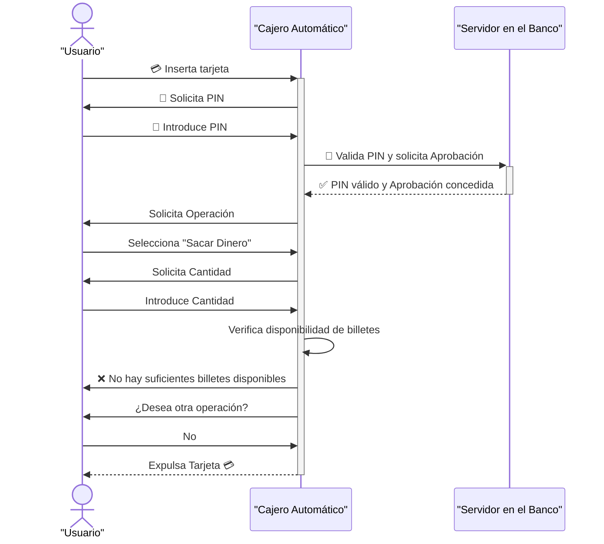
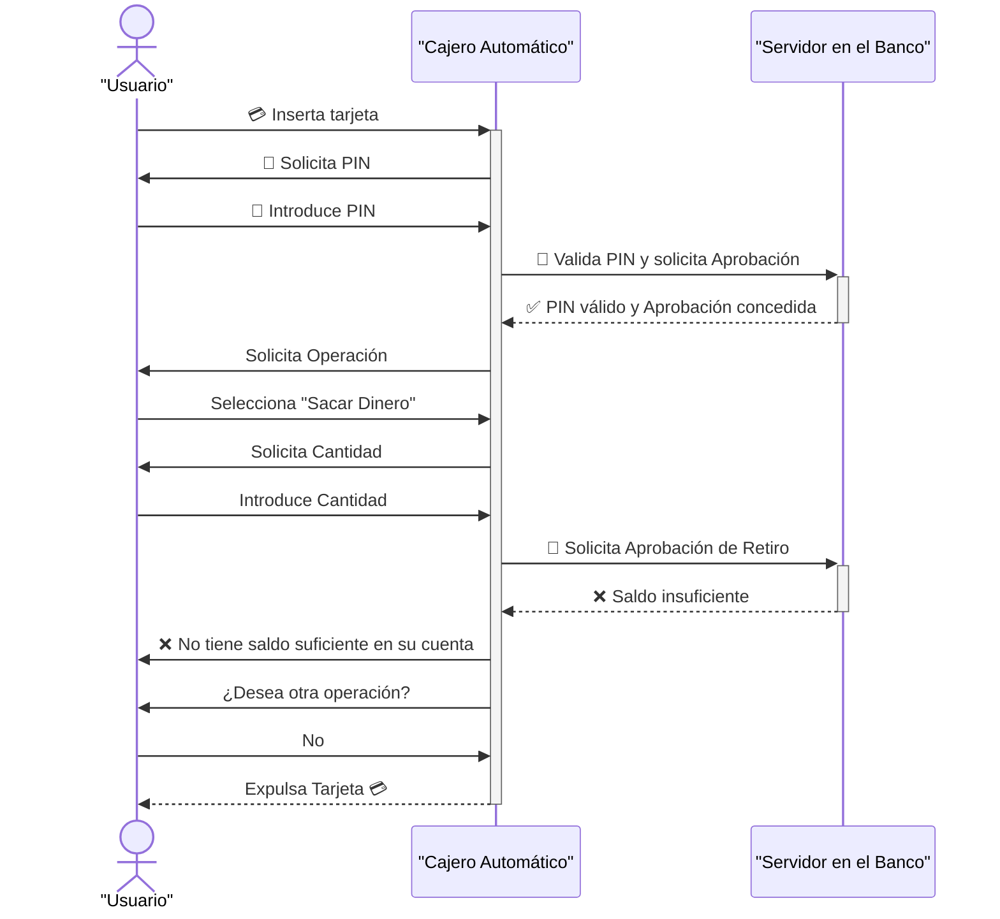

# UML?

Unified Modeling Language (UML). Es un lenguaje para hacer dibujos de diseño técnico de sistemas principalmente de software. Va muy orientado, sobre todo algunos tipos de diagramas a sistemas orientados a objetos.

La especificación de UML nace de la organización Object Management Group (OMG) en 1997. Desde entonces ha tenido varias versiones, la última es UML 2.5.1 de 2017.

Eso es.. hace casi 30 años! Qué tal le va al UML?

## Historia del UML

Cuando sale estop del UML nos volvemos locos con ello.
En esa época, montábamos los sistema de forma muy diferente a como lo hacemos hoy en día:
- Metodologías en cascada: REQUISITOS -> ANÁLISIS -> "DISEÑO" del sistema en su conjunto (semanas/meses)
- Proyectos con arquitecturas monolíticas: Sistemas enormes, con cientos de clases (o miles) que evidentemente necesitaban un diseño previo muy detallado, sino de una forma de comunicar el diseño a todo el equipo.
- Equipos grandes: Equipos de decenas o cientos de personas, donde la comunicación del diseño era fundamental.
- Había cierta obsesión con el papel / documentación: Los documentos de diseño eran muy importantes, y se esperaba que estuvieran bien detallados y completos (Normativas muy estrictas en algunos sectores como el aeroespacial, defensa, etc) + ITIL y CMMI.

Crearón herramienats para trabajar con UML, como Rational Rose (de Rational Software, luego comprada por IBM), Visual Paradigm, Enterprise Architect, etc. UN TOSTON DESCOMUNAL DE HERRAMIENTAS. Complejas, tediosas, caras.

Hacer diagramas era un proceso LENTO (como cajitas en un power point). Además, el mantenimiento era complejo.
Una cosa es un diseño... y otra cosa es el código final. Mantener ambos sincronizados era una tarea titánica.

Y esas herramienats intentaban hacer ese trabajo... mantener el diseño y el código sincronizados.
Eso era una ruina: Porque no hacíamos los diagramas para ser entendidos por humanos, sino para que las herramientas pudieran generar código o mantener el diseño sincronizado con el código. Y los humanos cuando hablamos tenemos una laxitud enorme en las gramáticas (nos las pasamos continuamente por las narices). Las herramientas no (son muy puntillosas con la sintaxis).

Todo eso hizo que poco a poco, sobre todo con los cambios de paradigma que nos fuimos encontrando (metodologías ágiles, arquitecturas orientadas a componentes desacoplados, equipos más pequeños, etc) el UML fuera perdiendo peso en el desarrollo de software. 

De hecho, muchas de esas herramientas complejas de UML han ido desapareciendo... las pocas que quedan están totalmente desactualizadas y obsoletas. Microsoft tenía soporte para UML dentro de Visual Studio... y lo quitaron hace años.

Había ilusión.. y burbuja! Pero ilusión. Cubría un hueco, una necesidad real. La forma de llevar estos diagramas a la práctica era mala, y UML fue muriendo. Se quedó simplemente como una anécdota que seguian enseñando en las universidades. Y 3 ideas de diagramas que en algunos proyectos muy concretos se seguían usando.

Esa es parte de la realidad... parte de la historia. Porque ahora hay otra parte!

UML se está redescubriendo... Y estamos empezando a usarlo un huevo! Muchísimo! Casí más que antes, en sus momentos de esplendor y gloria.

## ¿Qué ha pasado?

- La primera cosa que ha pasado es que hoy en día no estamos ya en el mundo de los monolitos dinosaurios. Hoy en día los sistemas son mucho más pequeños, modulares, desacoplados. Y montar esos diagramas es mucho más sencillo.
- La segunda cosa que ha pasado es que las metodologías ágiles han cambiado la forma de trabajar:
  - Ya no hacemos un diseño del sistema completo al principio del proyecto. Voy creando, poco a poco.. y voy haciendo hacemos diseños de componentes pequeños, que encajan en el sistema global.
  - No hacemos los documentos para programas. Eso de crear un diagrama de clases.. y que desde ese diagrama se genere código JAVA... en serio?
  - A la documentación hoy en día le damos mucha menos importancia. Hacemos diagramas para entendernos entre humanos, diagramas "light".
- Las herramientas que tenemos hoy en día, han cambiado un huevo. <<< CLAVE!

## Herramientas guays

Todas las herramientas guays.. y motivo principal para que hoy en día estemos tan encantados con UML son las herramientas que me permiten "escribir" diagramas.
Las herramientas antiguas me permitían "dibujar" diagramas. Y dibujar es lento, tedioso, pesado.
Hoy en día, los diagramas los escribimos. 
Tenemos lenguajes que nos permiten escribir diagramas compatibles con UML de forma rápida y sencilla.

Es más... hoy en día (Diciembre 2025) ni nos molestamos en escribir esos diagramas. Tenemos ayudantes (baratitos, poco coste de SS y de nóminas) que además escriben mucho mejor que nosotros: IAs.

Muchas de esas herramientas son expertas en escribir en lenguajes (LLM). Pero no solo eso, sino que son aún más expertas en usar lenguajes formales.

Pero se junta con otro factor. Hoy en día, los diagrams los escribimos para seres humanos. Y los seres humanos tenemos una capacidad creativa y de interpretación brutal. Podemos entender diagramas que no son 100% correctos (se ajuste perfectamente a la gramática UML), que tienen errores, que no siguen las reglas al pie de la letra.

Y es lo que buscamos hoy en día con los diagramas. Una forma de facilitar la comunicación entre humanos. No buscamos generar código, ni mantener sincronizados los diagramas con el código.

No quiero ser el Shakespeare de los diagramas UML... ni el Cervantes de los diagramas UML. Quiero ser un tipo que hace diagramas UML rápidos, sencillos, sin complicarme... pisoteando la gramática si es necesario.. o si no conozco ciertas cosas... pero al final diagramas que me ayuden a comunicarme EFICAZMENTE con mis compañeros / clientes.

No nos obsesionesmos con la perfección. Busquemos la eficacia.

La idea all final es estandarizar la forma en la que pintamos esos diagramas. Y UML es un estándar aceptado por todo el mundo. Oye.. como todo lenguaje, con sus reglas gramaticales.. es complejo.. tiene muchas triquiñuelas... pero.. tampoco necesito ser el Shakespeare de UML para poder comunicarme de forma eficaz y eficiente con mis compañeros.

Las 2 herramienats que hoy en día adoramos para la creación de diagramas UML son:
- Mermaid.js: https://mermaid-js.github.io/mermaid/#/
- PlantUML: https://plantuml.com/es/

Ambas son librerías que ofrecen un lenguaje para escribir diagramas.
- Mermaid permite hacer muchos diagramas, no solo UML. Y no permite hacer todos los diagramas que define el estandar UML.
- PlantUML está mucho más orientado al estandar UML, y permite hacer todos los diagramas UML. Pero son más feos. Y el lenguaje es un poco más áspero.

Decisión 1: Si puedo hacer el diagrama que quiero hacer con Mermaid, uso Mermaid. Si no, uso PlantUML.

---

## Documentación

La documentación en los proyectos de software también ha ido evolucionando un huevo!
Antiguamente escribíamos "tochos" de documentación en Word, o en herramientas de documentación complejas (como DOORS, etc). Documentos enormes, pesados, difíciles de mantener. RUINA !!! Ya lo aprendimos!

Cuál es el estandar hoy en día para documentación técnica en proyectos de software? Qué uso para documentar? MARKDOWN!

Es un lenguaje que me permite escribir documentación. Sin florituras, sin complicaciones. Simplemente texto plano con algunas reglas sencillas para dar formato.

La documentación se guarda con el código, en el repo, que es donde tiene que estar. Y cuando alguien entra al repo, ve la documentación formateada de forma automática.

---

# Para sirven los gráficos?

- Para facilitar la comunicación entre humanos.
- Y al crear un DTE, vamos en capas... poco a poco.

En general al comenzar un proyecto de software, vamos poco a poco.
¿Cuál es el primer obstaculo al que nos enfrentamos cuando empezamos a diseñoar un sistema de software?

- Sincronizar mi lenguaje con el del cliente / usuarios.
- Una vez sincronizados los lenguajes, entender bien qué es lo que quieren / necesitan (bajo de nivel)
- Una vez entendido qué es lo que quieren / necesitan, empiezo a plantear un sistema que lo satisfaga.
- Una vez planteado el sistema, empiezo a diseñar los componentes del sistema.

No empiezo un proyecto montando el diagrama de clases del sistema. Eso es una locura. Si posiblemente aún ni siquiera sé qué es lo que quieren los usuarios.

- Diagrama de casos de uso (use case diagram): Primer diagrama que hago. Me ayuda a entender quiénes son los actores del sistema, y qué necesitan del sistema.
- Diagrama de actividades (activity diagram): Me ayuda a entender los procesos / flujos de trabajo que los actores quieren llevar a cabo con el sistema.
- Diagrama de secuencia (sequence diagram): Me ayuda a entender cómo interactúan los actores con el sistema, y cómo se comporta el sistema ante esas interacciones.
- Diagrama de componentes/paquetes (component diagram): Me ayuda a entender los componentes del sistema, y cómo se relacionan entre sí.
- Diagrama de clases (class diagram): Me ayuda a entender la estructura estática del sistema, las clases, atributos, métodos y relaciones entre clases.
- Diagrama de máquinas de estado (state machine diagram): Me ayuda a entender los estados por los que puede pasar un objeto del sistema, y cómo cambia de estado ante ciertos eventos.

Otra cosa importante a la hora de crear diagramas, que ha cambiado mucho en los últimos años, es el nivel de detalle.

Tengo que representar en un diagrama TODO el sistema? Todos los comportamientos? Todas las clases? Todos los atributos y métodos? NO. Antiguamente SI!!!! 

Por que el diagrama era interpretado por herramientas, que generaban código, etc. Hoy en día NO. Hoy en día los diagramas son para humanos. Y creo un diagrama para contar lo que me interesa contar. Y para lo mismo, quizás hago 5 diagramas. Con más nivel de detalle o menos nivel de detalle; explicando unos casos de uso u otros.

## Inicio de un proyecto de software 

No se empieza por los requisitos. Se empieza por entender quiénes son los actores del sistema, y qué necesitan del sistema: CASOS DE USO (USE CASES).

UML define un diagrama específico para esto: DIAGRAMA DE CASOS DE USO (USE CASE DIAGRAM).

Lamentablemente Mermaid no soporta este diagrama. Así que usaremos PlantUML para ello.

> Ejemplo: Un diagrama de casos de uso para el software que va instalado en un cajero automático (ATM) del banco.

## Requisitos:

- Caso de uso 1: Identificarse
  Requisitos associados:
  - El sistema debe permitir a los clientes identificarse mediante una tarjeta bancaria y un PIN.
  - El cliente puede intentar identificarse hasta 3 veces antes de bloquear la tarjeta.
  - En la tarjeta está el pin, pero no vale solamente con eso, es necesario solicitar confirmación al backend del banco, caso que la tarjeta haya sido bloqueada/revocada por seguridad.
  - El pin tendrá 4 dígitos.

## Diagrama de secuencia para la operación "Sacar dinero"

Este diagrama debe incluir Toda la secuencia Real de operaciones que se llevan a cabo en el sistema para realizar la operación de sacar dinero? NO. Contaré solo lo que me interesa contar.... hablaré de los escenarios que me interese hablar. No estoy escribiendo el CÓDIGO del sistema.

En el código debo tener TODO lo que efectivamente hace el sistema. En el diagrama solo lo que me interesa contar.

> Happy path: El camino feliz, el escenario principal.

->>     =       - > >     Mensaje síncrono, que queda esperando respuesta.
-->>                      Mensaje asíncrono, no queda esperando respuesta.

> Ejemplo con el usuario metiendo mal el pin 3 veces

> Ejemplo: No hay billetes suficientes en el cajero

> Ejemplo: El usuario no tiene saldo suficiente

## Diagramas más complejos!

Esos son diagramas muy simplones. Puedo llegar a mucho más nivel de detalle.

No empiezo con estos diagramas. No tiene sentido. Tenemos que hacernos, con la operativa, con los detalles, con el lenguaje!

```mermaid

sequenceDiagram

    actor                   U as Usuario
    participant             C as Cajero
    participant             S as Servidor

    U->>C:                  💳 Insertar tarjeta

    rect rgb(255,240,230)
        note left of C:                 LECTURA DE LA TARJETA
        critical                        Leer tarjeta
        option                          Tarjeta caducada
            rect rgb(255,230,200)
                break                   No se puede procesar la operación
                    C-->>U:                 Tarjeta caducada
                    C-->>U:                 💳 Entrega la tarjeta
                end
            end
        option                          Error al leer la tarjeta
            rect rgb(255,230,230)
                break               
                    C-->>U:                 Tarjeta no legible
                    C-->>U:                 💳 Entrega la tarjeta
                end
            end
        end
    end
    rect rgb(255,255,230)
        note left of S:                 PIN
        loop                            Hasta 3 intentos si el pin no es válido
            rect rgb(235,235,200)
                note left of C:         Obtención del PIN
                C-->>U:                 Solicitar PIN
                critical                Esperar el PIN
                    U->>C:                  Escribe su PIN
                option                  No se ha introducido el PIN en 30 segundos
                    rect rgb(255,230,230)
                        break
                            C->>U:          No se puede procesar la operación
                            C->>U:          💳 Entrega la tarjeta
                        end
                    end
                end
            end 
            rect rgb(235,235,180)
                note left of S:         Validación del PIN
                C->>+S:                 Solicitar validación del PIN de la tarjeta
                critical                Validar PIN
                        S-->>C:         PIN correcto
                option                  PIN incorrecto
                        S-->>C:         PIN incorrecto
                option                  Servidor con problemas internos
                    S-->>-C:             Notifica problemas internos
                option                  Timeout
                    note left of S:     El servidor no contesta
                end

                opt                     Si ha habido timeout o problemas internos
            rect rgb(255,230,230)
                    break               No se puede validar el PIN
                        C-->>U:         💳 Entrega la tarjeta
                        C-->>U:         No se puede procesar la operación
                    end
                    end
                end
            end 
        end

            rect rgb(235,235,180)
        critical                Si no se ha conseguido un PIN correcto
            rect rgb(255,230,230)
                    break               
                        C-->>U:         💳 Entrega la tarjeta
                        C-->>U:         No se puede procesar la operación
                    end
                end
            end
            end
    end 

    rect rgb(240,240,255)
        note left of S:     SACAR DINERO

        loop Hasta 3 intentos si la cantidad no es válida
            rect rgb(230,230,255)
                note left of C:         Cantidad
                C-->>U:                 Solicitar cantidad
                critical                     Esperar la cantidad la Cantidad
                    U->>C:                  Escribe la cantidad
                    opt                 Si no hay suficiente dinero o <BR/>no se le puede entregar
                        C-->>U:         No hay tanto dinero o <BR/>debe introducir una cantidad <BR/>múltiplo del tipo de<BR/> billetes disponibles
                    end
                option                 No se ha introducido la cantidad en 30 segundos
            rect rgb(255,230,230)
                        break                 
                            C-->>U:                 No se puede procesar la operación
                            C-->>U:                 💳 Entrega la tarjeta
                        end
                        end
                end
            end 
            rect rgb(230,230,255)

        critical                Confirmar con el servidor
        C->>S:                 Retirar importe solicitado
        S-->>C:                OK
        option                 No hay suficiente dinero en la cuenta
            S-->>C:            No hay suficiente dinero
            C-->>U:            No hay suficiente dinero
        option                Error del servidor
            rect rgb(255,230,230)
            S-->>C:            Error del servidor
            break                   Sistema no operativo
                C->>U:                 No se puede procesar la operación
                C->>U:                 💳 Entrega la tarjeta
            end
            end
        option              Timeout
            rect rgb(255,230,230)
            break                   Sistema no operativo
                C->>U:                 No se puede procesar la operación
                C->>U:                 💳 Entrega la tarjeta
            end
            end
        end
        end
        end
                    rect rgb(230,230,255)
        critical                Si no se ha conseguido una cantidad Correcta
            rect rgb(255,230,230)
                    break               
                        C-->>U:         💳 Entrega la tarjeta
                        C-->>U:         No se puede procesar la operación
                    end
                end
            end
            end

        C-->>U:                 💳 Entrega la tarjeta
        C-->>U:                 💰 Entrega el dinero
    end

```

---

## Lenguajes formales vs Lenguajes naturales

Lenguajes naturales, los que usamos los humanos: Español, Inglés, Chino, etc.
En los lenguajes naturales, la gramática la pisamos de forma continua. Nos saltamos reglas, inventamos palabras, usamos expresiones que no existen, etc. Y la gente me entiende perfectamente.
Los lenguajes formales son lenguajes con una gramática estricta.

    Matemático:   3 + 5 = 8
                  3 = 5 8 +

                  tres más cinco es igual a ocho