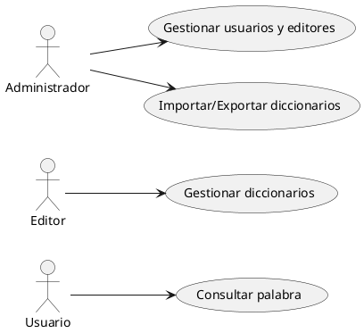
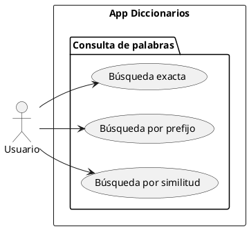
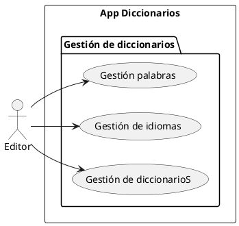
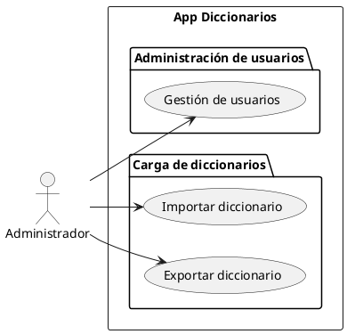
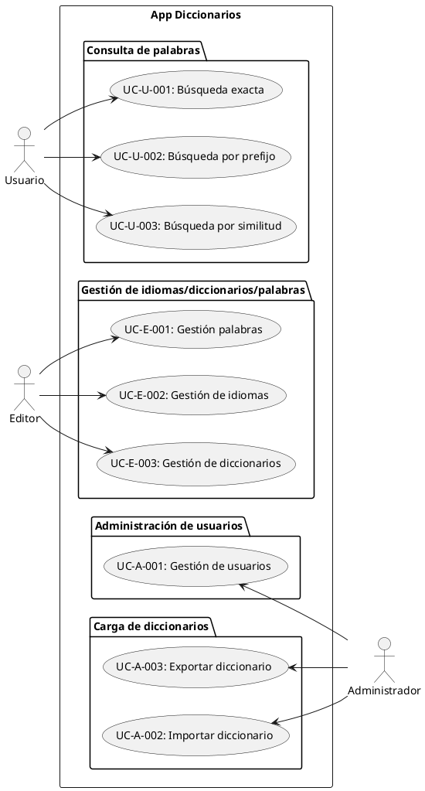
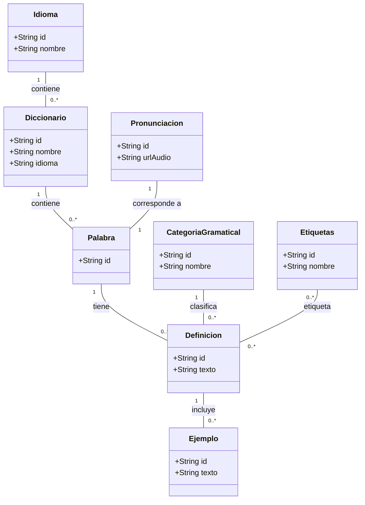
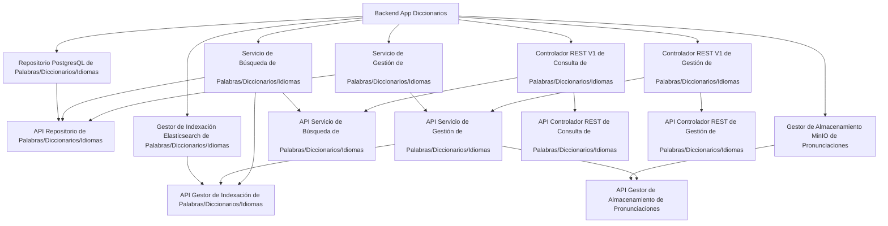
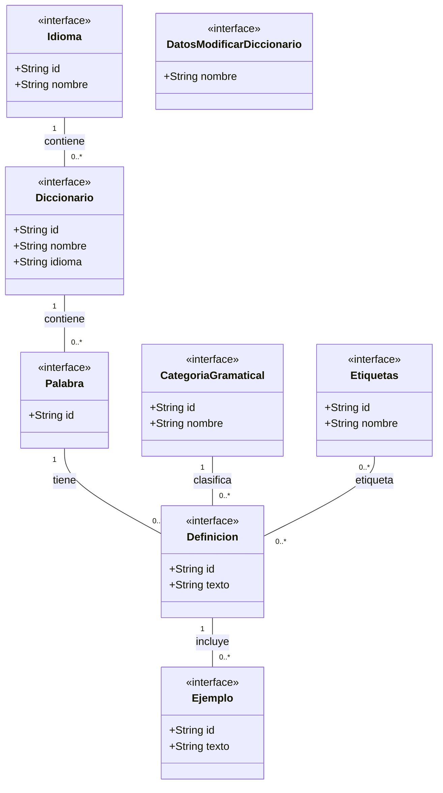
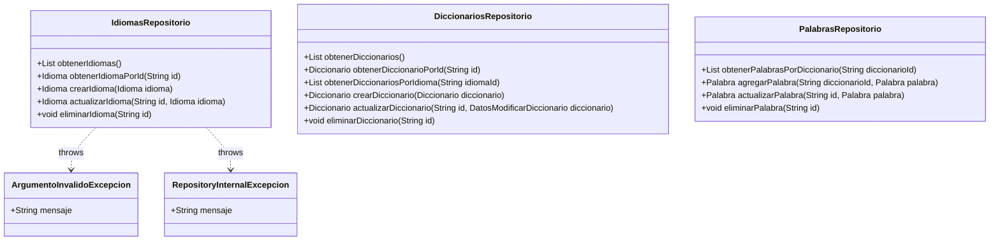
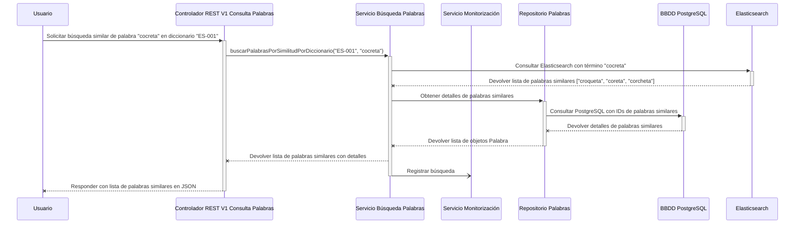

# App Diccionarios

## Objetivo

Será una App Web. 
Nos vamos a centrar en este documento en el backend.
Va a ser un microservicio(s) que exponga una API REST para trabajar con diccionarios de palabras... y hacer búsquedas de palabras y otras funciones que puedan ser de interés.

## Actores y Casos de Uso

### Diagrama general de casos de uso



### Analicemos más despacio a nuestro Usuario



#### Comentarios/Observaciones:

> La búsqueda exacta, quién me la puede resolver bien?
Base de datos relacional? SI

> La búsqueda por prefijo, quién me la puede resolver bien?
Base de datos relacional? SI:  LIKE %

> Busqueda por similitud? 
Necesito herramientas especializadas: 
- Elasticsearch (indexador)
   Quiero buscar la palabra     cocreta --> croqueta
                                ierva   --> hierba
- Oracle: Oracle Text

### Analicemos más despacio a nuestro Editor



### Analicemos más despacio a nuestro Administrador



### Si no es muy complejo, incluso podría juntarlo todo en un solo diagrama



#### Roles:
- Administrador
- Editor
- Usuario

#### Entidades:
- Diccionario
- Palabra
- Definiciones
- Ejemplos
- Categoria gramatical
- Pronunciación
- Idioma

## Requisitos funcionales / No funcionales

- UC-U-001: Búsqueda exacta
    - RF-001: El sistema permitirá a los usuarios buscar palabras exactas en un diccionario, de un idioma específico.
    - RF-002: El sistema devolverá las definiciones, con ejemplos y categoria gramatical, pronunciación de la palabra buscada.
    - RF-003: El sistema debe permitir reproducir la pronunciación de la palabra.
... Me puedo pasar rato.

---

Pronunciación de la palabra: AUDIO.

> Dónde lo guardo? BBDD Relacional? Poder puedo... BLOB.. pero esto es ruina.
> Posiblemente me interese un almacenamiento orientado a objetos: S3, MinIO, etc.

## Arquitectura de la información

Aquí vamos a entrar más en detalle de esas entidades:

### Diagrama entidad-Relación ... existe esto en UML?

En UML y en POO se considera las entidades son un tipo de clases.



> Notas: 

Los Ids de las entidades, pueden ser UUIDs o códigos (ejemplo: Idioma Español: ES) (otra cosa es que de cara a una BBDD relacional, usemos enteros autoincrementales adicionalmente para favorecer las relaciones).

## Arquitectura del sistema (Backend)


BBDD para guardar datos estructurados: PostgreSQL
Indexador para búsquedas por similitud: Elasticsearch
Almacenamiento de ficheros (audio pronunciaciones): MinIO / S3

Backend:
    Controlador API REST gestion-usuarios
    Controlador API REST import-export-diccionarios
    Controlador API REST gestion-diccionarios
    Controlador API REST consulta-palabras

### Diagrama de componentes / paquetes palabras

Puedo comenzar haciendo un modelado TOP-BOTTOM (controlador) o un BOTTOM-UP (dominio)



```xml
<!-- pom.xml dependencias -->
<modules>
    <module>api-repositorio-palabras</module>
    <module>repositorio-postgresql-palabras</module>
    <module>api-servicio-busqueda-palabras</module>
    <module>api-servicio-gestion-palabras</module>
    <module>servicio-busqueda-palabras</module>
    <module>servicio-gestion-palabras</module>
    <module>api-controlador-rest-consulta-palabras</module>
    <module>api-controlador-rest-gestion-palabras</module>
    <module>controlador-rest-v1-consulta-palabras</module>
    <module>controlador-rest-v1-gestion-palabras</module>
    <module>app-diccionarios-backend</module>
</modules>

<!-- pom.xml del app-diccionarios-backend -->
<dependencies>
    <dependency>
        <groupId>com.ejemplo</groupId>
        <artifactId>controlador-rest-v1-consulta-palabras</artifactId>
        <version>1.0.0</version>
    </dependency>
    <dependency>
        <groupId>com.ejemplo</groupId>
        <artifactId>controlador-rest-v1-gestion-palabras</artifactId>
        <version>1.0.0</version>
    </dependency>
    <dependency>
        <groupId>com.ejemplo</groupId>
        <artifactId>repositorio-postgresql-palabras</artifactId>
        <version>1.0.0</version>
    </dependency>
    <dependency>
        <groupId>com.ejemplo</groupId>
        <artifactId>servicio-busqueda-palabras</artifactId>
        <version>1.0.0</version>
    </dependency>
    <dependency>
        <groupId>com.ejemplo</groupId>
        <artifactId>servicio-gestion-palabras</artifactId>
        <version>1.0.0</version>
    </dependency>
</dependencies>

<!-- pom.xml del controlador-rest-v1-consulta-palabras -->
<dependencies>
    <dependency>
        <groupId>com.ejemplo</groupId>
        <artifactId>api-controlador-rest-consulta-palabras</artifactId>
        <version>1.0.0</version>
    </dependency>
    <dependency>
        <groupId>com.ejemplo</groupId>
        <artifactId>api-servicio-busqueda-palabras</artifactId>
        <version>1.0.0</version>
    </dependency>
```

```java

public interface IdiomasService {
    List<Idioma> obtenerIdiomas();
    Idioma obtenerIdiomaPorId(String id);
    Idioma crearIdioma(Idioma idioma);
    Idioma actualizarIdioma(String id, Idioma idioma);
    void eliminarIdioma(String id);
}

public interface DiccionariosService {
    List<Diccionario> obtenerDiccionarios();
    Diccionario obtenerDiccionarioPorId(String id);
    List<Diccionario> obtenerDiccionariosPorIdioma(String idiomaId);
    Diccionario crearDiccionario(Diccionario diccionario);
    Diccionario actualizarDiccionario(String id, Diccionario diccionario);
    void eliminarDiccionario(String id);
}

public interface GestionPalabrasService {
    List<Palabra> obtenerPalabrasPorDiccionario(String diccionarioId);
    Palabra agregarPalabra(String diccionarioId, Palabra palabra);
    Palabra actualizarPalabra(String id, Palabra palabra);
    void eliminarPalabra(String id);
}
public interface BusquedaPalabrasService {
    List<Palabra> buscarPalabrasExactasPorDiccionario(String diccionarioId, String termino);
    List<Palabra> buscarPalabrasPorPrefijoPorDiccionario(String diccionarioId, String prefijo);
    List<Palabra> buscarPalabrasPorSimilitudPorDiccionario(String diccionarioId, String termino);
    List<Palabra> buscarPalabrasExactasPorIdioma(String idiomaId, String termino);
    List<Palabra> buscarPalabrasPorPrefijoPorIdioma(String idiomaId, String prefijo);
    List<Palabra> buscarPalabrasPorSimilitudPorIdioma(String idiomaId, String termino);
}
```
#### Capa dominio

##### Diagrama de componentes API Del Repositorio de Palabras/Diccionarios/Idiomas

###### Modelos del API Repositorio de Palabras/Diccionarios/Idiomas

##### Diagrama de clases API Repositorio PostgreSQL de Palabras/Diccionarios/Idiomas




#### Diagrama de secuencia para el backend de búsqueda similar de una palabra



---

Al montar un sistema, cada vez más nos centramos en la experiencia de usuario (UX).
Hacemos un diseño User-Centered Design (UCD).

En el mundo de la UX y del UCD hay disntas técnicas / metodologías para entender mejor a los usuarios y sus necesidades.
- Diagrama de Garrett. 5 capas:
    - Necesidades del usuario ~ Diagrama de casos de uso
    - Especificación Funcional ~ Requisitos
    - Estructura
      - Diseño de la interacción
      - Arquitectura de la información
    - Esqueleto (planteamos la UI)
    - Superficie (UI)
- Honeycomb de Peter Morville


---

# Programación REACTIVA

Esta estudiada y definida en una especie de estándar: Reactive Streams (https://www.reactive-streams.org/)

Hay un monton de implementaciones de Reactive Streams en distintos lenguajes de programación.
JS -> RxJS
Java -> Project Reactor, Spring WebFlux, Akka Streams

Es un tipo de programación asíncona, no bloqueante [ y orientada a flujos de datos (streams) ].

Programación asíncrona:
- Bloqueante
- No bloqueante
  - Con callbacks
  - Fire-and-forget

En ocasiones:

    Tengo el controlador REST
        Llama al servicio de forma asíncrona
        Deja anotado lo que hay que hacer cuando llegue la respuesta
        Y el acaba!

SpringWeb HTTP REST

Tomcat, Jetty, WebLoop -> Bloqueante
   Cada petición abre un hilo. Y puedo habrir cientos de hilos... pero no miles!
   Y eso limita el número de peticiones concurrentes que puedo atender.

Webflux / Netty -> No bloqueante
   Cada petición no abre un hilo. Usa un pool de hilos cerrado... y las tareas se dejan en pausa hasta que llegan las respuestas.
   Puedo atender miles de peticiones concurrentes.

llamarAsincronamente() -> Future/Promise     Vale por una camisa

unFuture.get()  // Bloqueante

await unPromise // Bloqueante

unPromise.then( 
    res => {
        // Hacer algo con res
    }
) // No bloqueante // Reactive

JAVA 8 --> java.util.function :: ->


---

# Máquina de café

Diagramas de casos de uso
Diagramas de secuencia
Diagramas de actividades
## Diagramas de estados

El modelo de máquinas de estados es un modelo matemático que describe el comportamiento de un sistema en términos de estados y transiciones entre esos estados.

Hay modelos muy tradicionales. UML definió su propio modelo de máquinas de estados basado en los modelos tradicionales pero con algunas extensiones.
Muchas herramiientas y librerías de software permiten definir máquinas de estados basadas en UML.
Spring State Machine es una librería de Java que permite definir máquinas de estados basadas en UML.

- State: Representa un estado en el que puede estar el sistema.
- Transition: Representa una transición entre dos estados, que ocurre en respuesta a un evento o condición (automáticos).
- Guard: Condición que debe cumplirse para que una transición pueda ocurrir.
- Efect/Action: Acción que se ejecuta cuando se produce una transición.
- Context: Conjunto de propiedades que pueden influir en el comportamiento de la máquina de estados.

Dentro de las máquinas de estados UML se habla de:
- Estados jerárquicos: Estados que contienen otros estados, permitiendo una organización en niveles.
- Estados paralelos:   Esto es raro... ya que rompe con el principio básico de una máquina de estados (un único estado activo en cada momento)

Componentes Web -> Máquinas de estados


                                    Sistema Backend
                                        Sesión de formación
                                           Pendiente de inicio
                                           Abierta para registro
                                           Espera
                                           Realizando pregunta
                                           Espera de respuesta
                                           Pregunta finalizada y Visualización de estadísticas
                                           Cerrada
Preguntas > App movil QR

    Pedido en una web de pedidos
        Carrito de la compra
        Pago
        Confirmación del pedido
        Preparación del pedido
        Envío del pedido
        Entrega del pedido


---


Tienda de Animalitos Fermín

    Alta de un animalito:
        Nombre,
        Tipo de animalito (perro, gato, pez, pájaro, roedor, reptil, etc.),
        Fecha de nacimiento
        Descripción
        Foto
    
    Datos de un animalito:
        ID PUBLICO
        Nombre,
        Tipo de animalito (perro, gato, pez, pájaro, roedor, reptil, etc.),
        Fecha de nacimiento
        Descripción
        Foto
        Estado (disponible, reservado, adoptado)
    
    Modificar datos de un animalito
        Tipo de animalito (perro, gato, pez, pájaro, roedor, reptil, etc.),
        Descripción
        Foto
        Estado

    Funciones:
        Animalito altaAnimalito(DatosDeAltaDeAnimalito)
        Animalito modificarAnimalito(ID_PUBLICO, DatosDeModificacionDeAnimalito)
        Animalito recuperarAnimalito(ID_PUBLICO)
        Animalito eliminarAnimalito(ID_PUBLICO)

SOLID:
    I: Interface Segregation Principle
        Muchas interfaces específicas mejor que una interfaz general.


---
