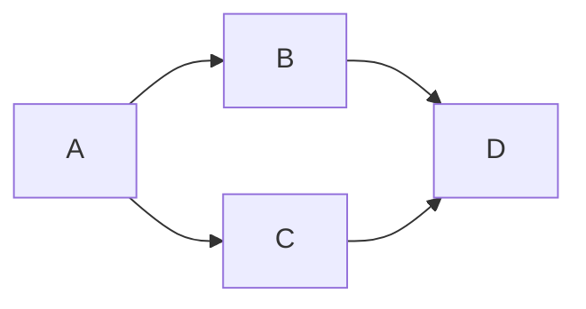
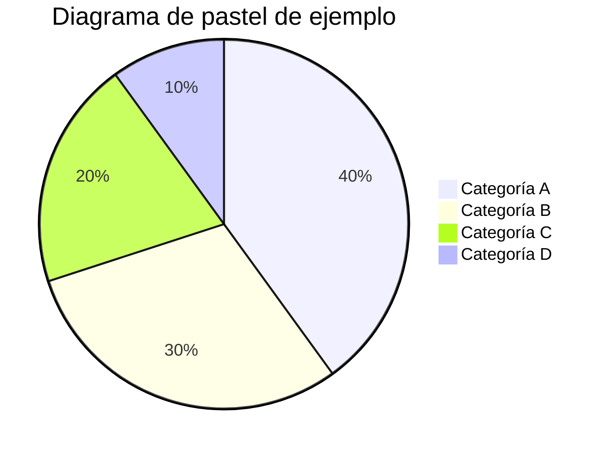

# Titulos
## Subtitulo
### Subsubtitulo

Y así hasta 7 niveles.

## Listas:

### No ordenadas

- Elemento 1
- Elemento 2
  + Sub elemento 2.1
  + Sub elemento 2.2
    * Sub sub elemento 2.2.1
    * Sub sub elemento 2.2.2  
- Elemento 3

+ Elemento 1
+ Elemento 2

### Ordenadas

1. Elemento 1
1. Elemento 2
   1. Sub elemento 2.1
   1. Sub elemento 2.2
      1) Sub sub elemento 2.2.1
      1) Sub sub elemento 2.2.2

## Tabla

| Encabezado 1  | Encabezado 2  | Encabezado 3  |
| ------------- | :-----------: | -------------:|
| Fila 1 Col 1  | Fila 1 Col 2  |               |
| Fila 2 Col 1  | Fila 2 Col 2  |  Col 3        |
| Fila 3 Col 1  | Fila 3 Col 2  |  Col 3        |

## Enlaces:
[Texto del enlace](https://www.ejemplo.com)

## Imágenes:


## Formatos de texto

En un texto puedo poner cosas en *enfasis* (cursiva) o en **fuerte énfasis** (negrita)... incluso en ambas: ***fuerte énfasis y énfasis***.

Cosas que ya no valen (tachado): ~~esto ya no vale~~

Nombres especialles de variables: `variableEspecial`

Este lenguaje se soporta nativamente por TODAS LAS PLATAFORMAS DE GESTIÓN DE PROYECTOS DE SOFTWARE MODERNAS (JIRA, Confluence, GitHub, GitLab, Bitbucket, etc).

En todo proyecto, en toda carpeta, encontramos un fichero README.md que usa este lenguaje para explicar cosas del proyecto.

Y esos programas, en cuantito entro a un repo de código, y encuentran en cualquier carpeta un fichero README.md... me lo muestran formateado, bonito, con tablas, imágenes, etc.

---

## Código

Me permite escribir bloques de código... que se formatean adecuadamente.

```java
public class HolaMundo {
    public static void main(String[] args) {
        System.out.println("Hola Mundo");
    }
}
```

```python
def hola_mundo():
    print("Hola Mundo")
```

Se aceptan cientos de lenguajes de programación.

Pero no solo lenguajes de programación:

```json
{
  "nombre": "Juan",
  "edad": 30,
  "ciudad": "Madrid"
}
```

```xml
<persona>
  <nombre>Juan</nombre>
  <edad>30</edad>
  <ciudad>Madrid</ciudad>
</persona>
```

```sql
SELECT * FROM personas WHERE edad > 18;
```





